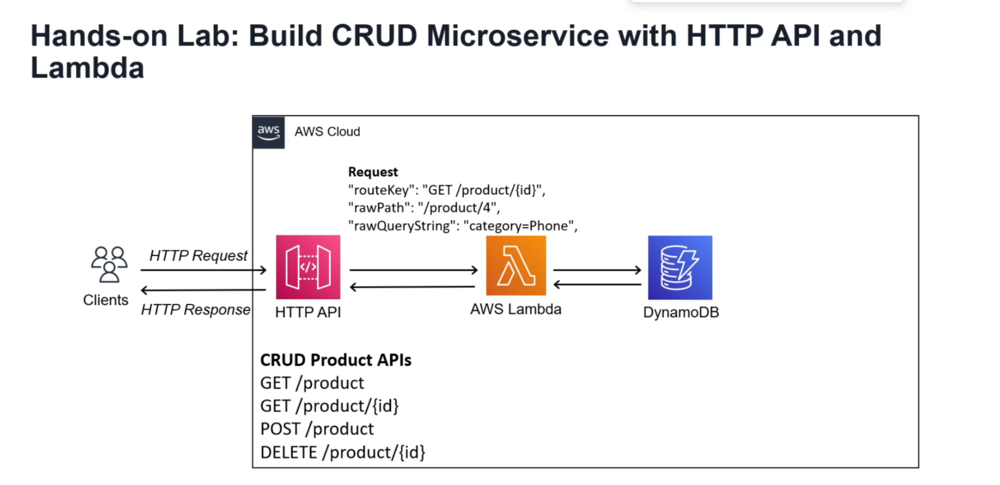
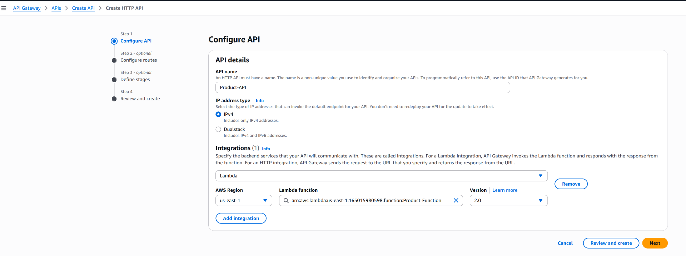
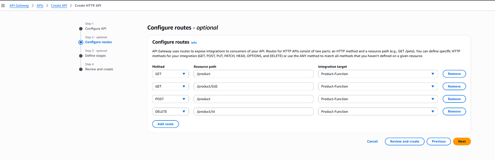

&nbsp;

(1) Create Lambda function

&nbsp;

- use default execution role & additional configurations
- change code & deploy : index.js

&nbsp;

(2) Create API

- Create HTTP API
    
- API name : Product API
    
- Integration : Lambda Integration
    
    - select above created lambda function here

- Configure Routes
    
    | Method | Resource Path | Integration Traget |
    | --- | --- | --- |
    | GET | /product | Lambda function |
    | GET | /product/{id} | Lambda function |
    | POST | /product | Lambda function |
    | DELETE | /product/{id} | Lambda function |
    
    &nbsp;
    
    
    
- Configure Stage : default
    

(3) Test API

- Test the API using Postman
- Use "Invoke URL" from Product API created
- Verify the response

| Method | URL | Body | Response |
| :---: | :---: | :---: | :---: |
| GET | https://lux0kqow43.execute-api.us-east-1.amazonaws.com/product |     | {"message":"Successfully finished operation: \\"GET /product\\"","body":"Processing Get All Products"} |
| GET | https://lux0kqow43.execute-api.us-east-1.amazonaws.com/product/105 |     | {"message":"Successfully finished operation: \\"GET /product/{id}\\"","body":"Processing Get Product Id with \\"105\\""} |
| POST | https://tbcilo5gwb.execute-api.us-east-1.amazonaws.com/product     | raw body:    {    "name": "IPhone",    "price": "950"    } | {"message":"Successfully finished operation: \\"POST /product\\"","body":"Processing Post Product Id with \\"\[object Object\]\\""} |
| DELETE | [https://tbcilo5gwb.execute-api.us-east-1.amazonaws.com/product/5?category=phone](https://tbcilo5gwb.execute-api.us-east-1.amazonaws.com/product/5) |     | {"message":"Successfully finished operation: \\"DELETE /product/{id}\\"","body":"Processing Delete Product Id with \\"105\\""} |

&nbsp;

&nbsp;