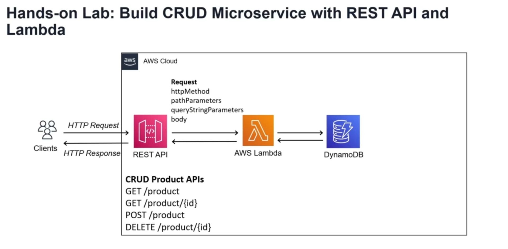
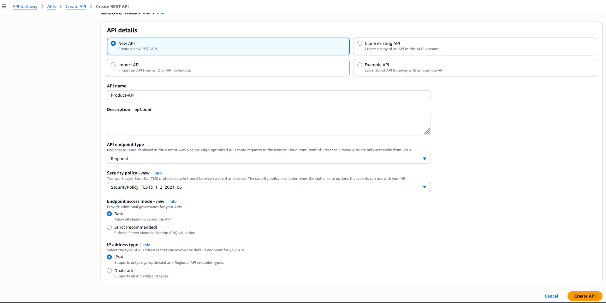
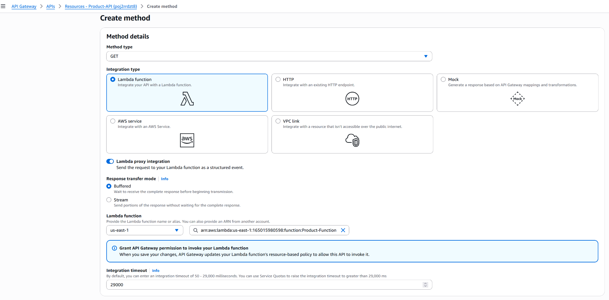
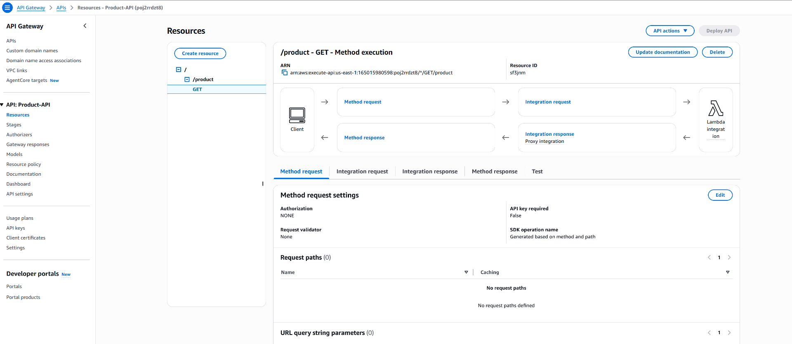
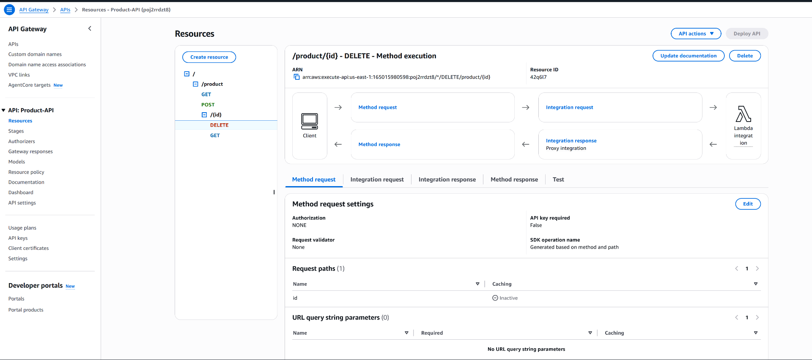
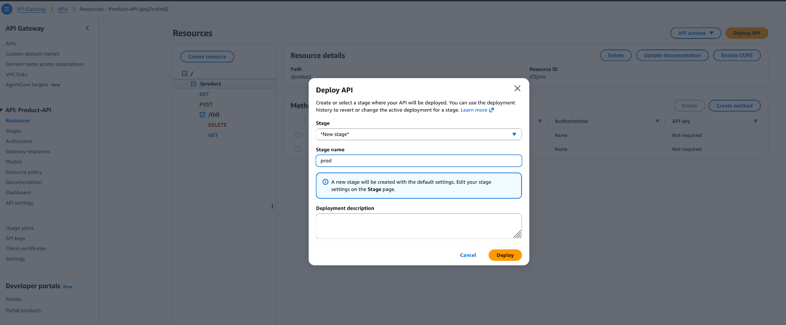

&nbsp;

(1) Create Lambda function

- use default source code
- add a instruction to log incoming event

&nbsp;

```
export const handler = async (event) => {
  console.log('Received event:', JSON.stringify(event, null, 2));
  const response = {
    statusCode: 200,
    body: JSON.stringify('Hello from Lambda!'),
  };
  return response;
};
```

&nbsp;

(2) Create API

- Create REST API : "Product-API"



- Create Resource : "product"


&nbsp;

- Create Methods for "product resource
    - Create GET & POST methods
    - Enable "Lambda proxy integration" - to capture the each request as event inside the lambda function





&nbsp;

- Create "{id}" resource under "product"
    - select "product" resource and then select "Create Resource"


- Create Methods for "{id}" resource
    - Create GET & DELETE methods
    - Enable "Lambda proxy integration" - to capture the each request as event inside the lambda function

&nbsp;

- Final Resource Tree (or) API Resource hierarchy



&nbsp;

- Deploy API
    - create new stage : "prod"



- "prod" stage is created with a deployment connected


&nbsp;

(3) Test API

- Test the API using Postman
- Get the  "Invoke URL" from "prod" stage
- Verify the response
- Capture event objects created for each API request and explore the event parameters

&nbsp;


&nbsp;

| Method | URL | Body | Response |
| :---: | :---: | :---: | :---: |
| GET | [https://poj2rrdzt8.execute-api.us-east-1.amazonaws.com/prod/product](https://poj2rrdzt8.execute-api.us-east-1.amazonaws.com/prod/product%5B%5D) |     | "Hello from Lambda!" |
| GET ID | [https://poj2rrdzt8.execute-api.us-east-1.amazonaws.com/prod/product/521](https://poj2rrdzt8.execute-api.us-east-1.amazonaws.com/prod/product/521%5B%5D) |     | "Hello from Lambda!" |
| POST | https://poj2rrdzt8.execute-api.us-east-1.amazonaws.com/prod/product  <br><br/> | raw body:  <br><br/>{  <br><br/>"name": "IPhone",  <br><br/>"price": "950"  <br><br/>} | "Hello from Lambda!" |
| DELETE | [https://poj2rrdzt8.execute-api.us-east-1.amazonaws.com/prod/product/{id}](https://poj2rrdzt8.execute-api.us-east-1.amazonaws.com/prod/product/%7Bid%7D)[](https://tbcilo5gwb.execute-api.us-east-1.amazonaws.com/product/5) |     | "Hello from Lambda!" |

&nbsp;

&nbsp;