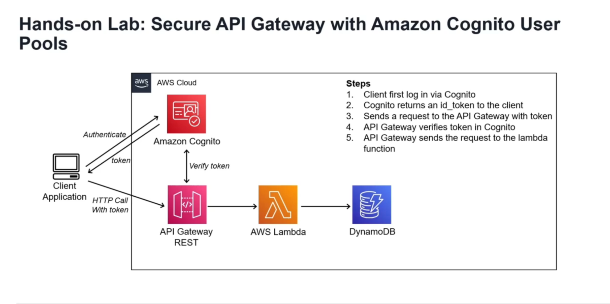

&nbsp;

(1) Create a Lambda function

- - use default code
        - Add trigger
            - REST API

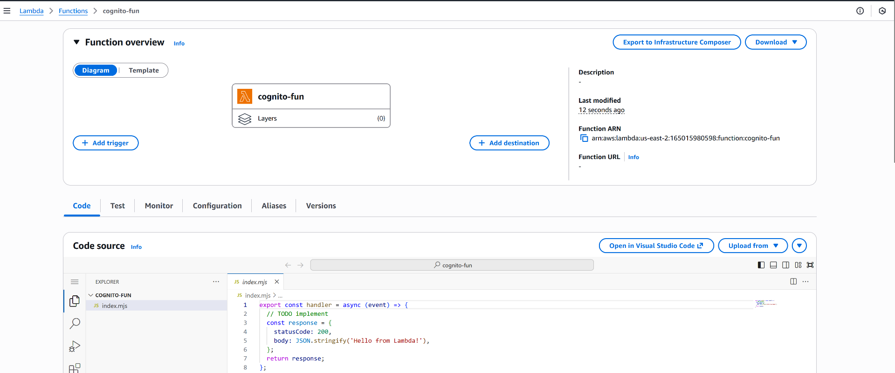

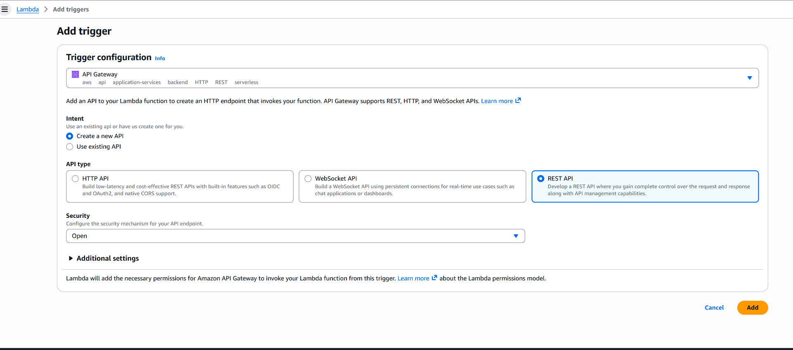


* * *

* * *

(2) Test API

- Open API endpoint URL
- Result : "Hello from Lambda!"

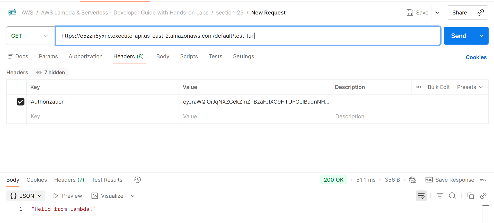

&nbsp;

* * *

* * *

(3) Create a Cognito User pool

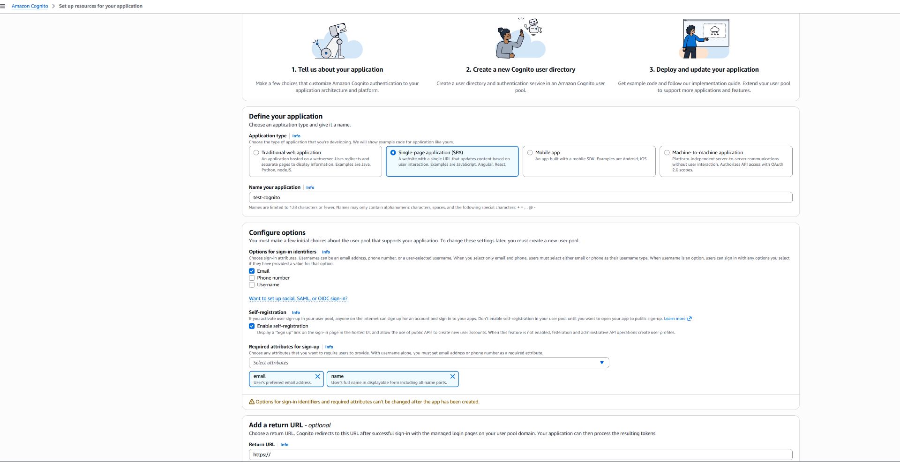

- Edit password policy
    - configure custom policy settings

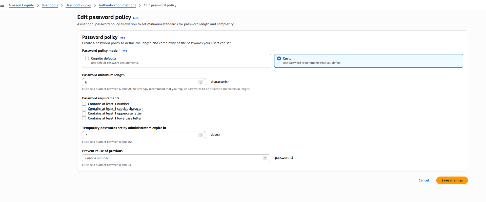

- App client : test-cognito

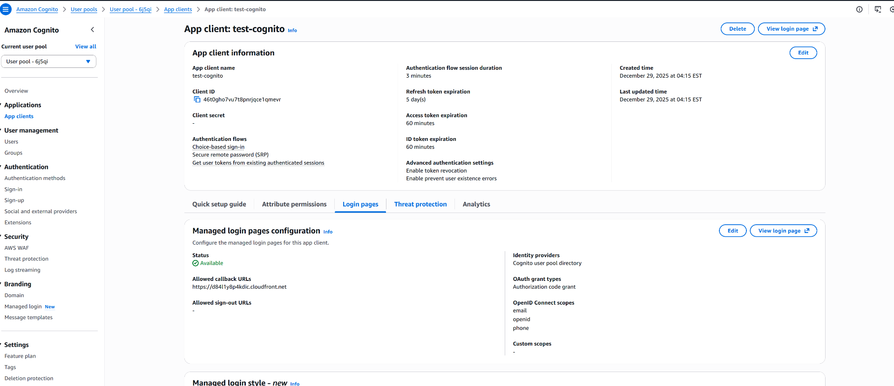

- change "Oauth 2.0 grant types"
    - include "implicit grant" ==( to get access token in URL , not recommended for production )==

&nbsp;

- 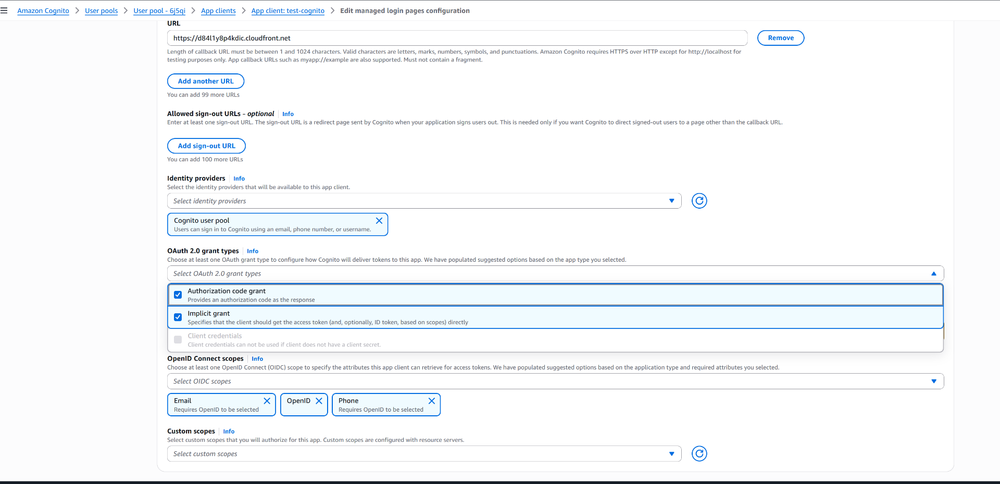

&nbsp;

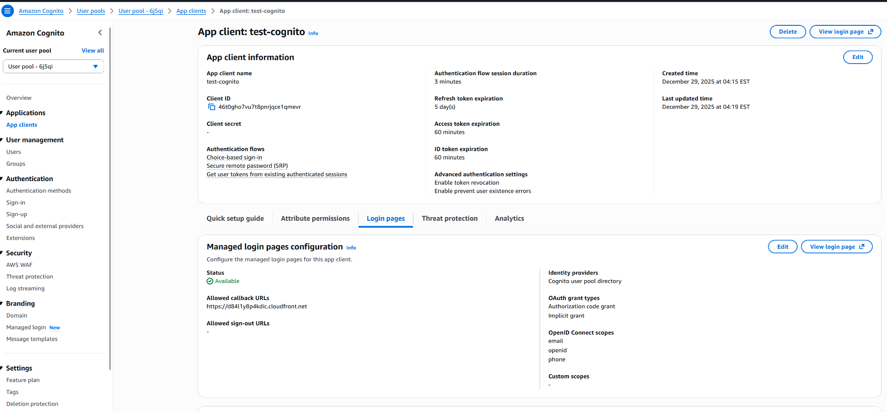

* * *

* * *

&nbsp;

(4) Update API Gateway

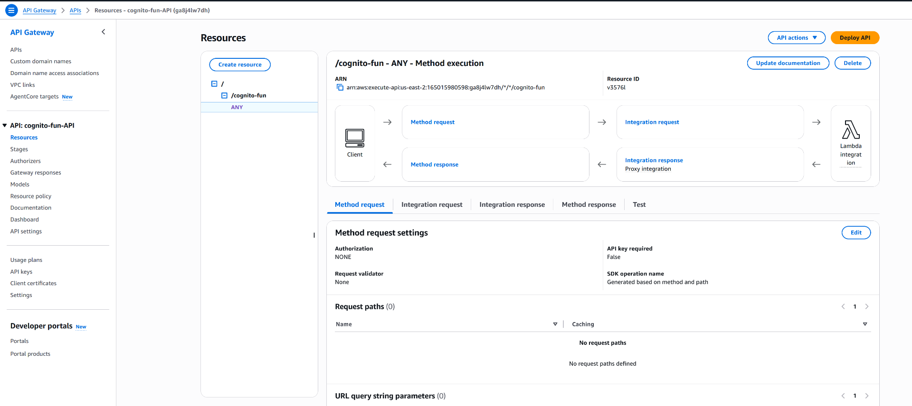

- Add authorizer
    - Authorizer type : Cognito
    - select create Cognito user pool
    - Token source : Authorization ==( Header that contains authorization token )==

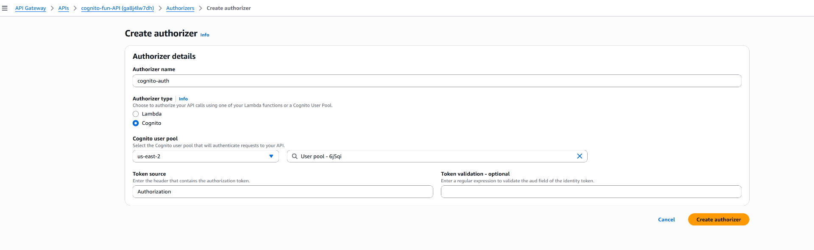

- "ANY" Method of "/cognito-fun" resource
    - Edit and change Authorization

&nbsp;


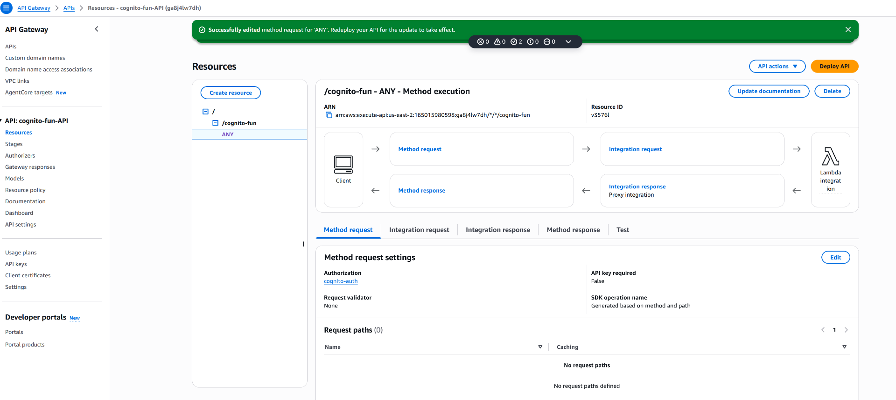

&nbsp;

- Deploy API
    - select "default" stage

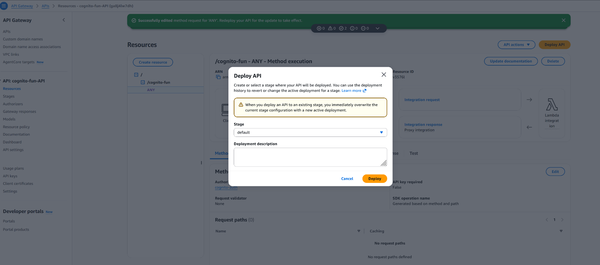

* * *

* * *

&nbsp;

(5) Test API

- Send GET API Request  to the "Invoke URL"
- Result : "Unauthorized"

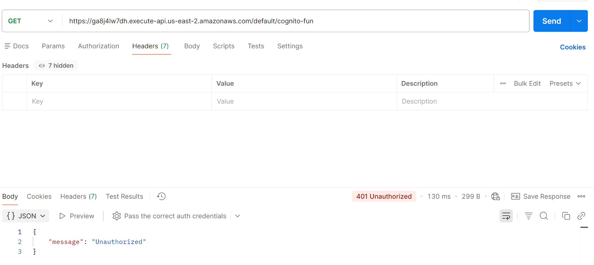

* * *

* * *

&nbsp;

(6) Get Access token from Cognito

- Step-1 : Open "View login page" from created App client

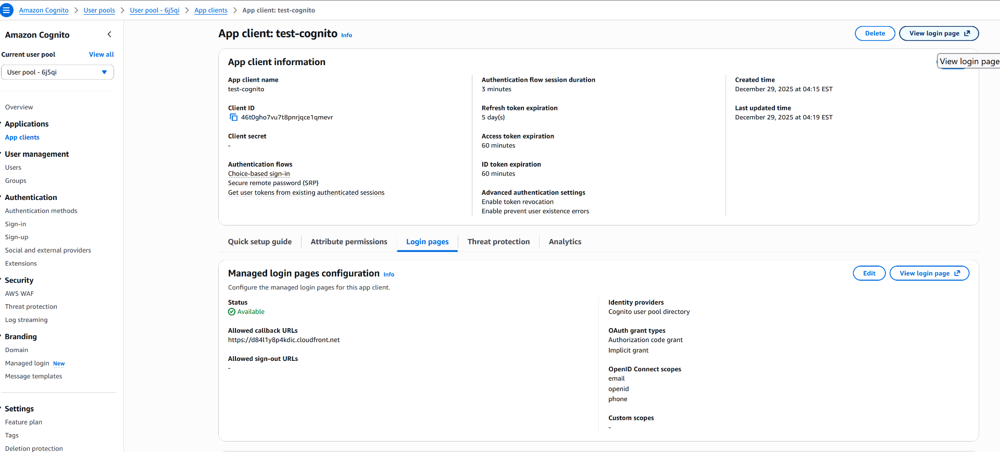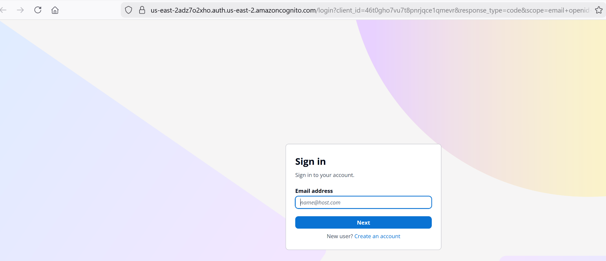

- Step-2: Create Account

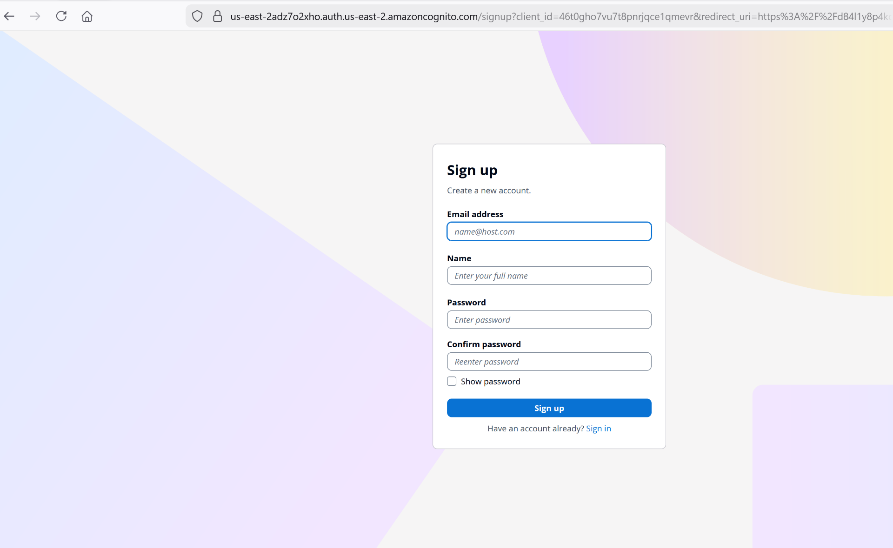

&nbsp;

- Step-3: Copy URL & reopen the changed URL
    - change response_type=token in the URL
    - paste changed URL and re-open the page
    - Fill user info
    - use temporary email address
    - sign up

```
Original :
https://us-east-2adz7o2xho.auth.us-east-2.amazoncognito.com/signup?client_id=46t0gho7vu7t8pnrjqce1qmevr&redirect_uri=https%3A%2F%2Fd84l1y8p4kdic.cloudfront.net&response_type=code&scope=email+openid+phone

https://us-east-2adz7o2xho.auth.us-east-2.amazoncognito.com/signup?client_id=46t0gho7vu7t8pnrjqce1qmevr&
redirect_uri=https%3A%2F%2Fd84l1y8p4kdic.cloudfront.net&
response_type=code&
scope=email+openid+phone

Change to: 

https://us-east-2adz7o2xho.auth.us-east-2.amazoncognito.com/signup?client_id=46t0gho7vu7t8pnrjqce1qmevr&redirect_uri=https%3A%2F%2Fd84l1y8p4kdic.cloudfront.net&response_type=token&scope=email+openid+phone

https://us-east-2adz7o2xho.auth.us-east-2.amazoncognito.com/signup?client_id=46t0gho7vu7t8pnrjqce1qmevr&
redirect_uri=https%3A%2F%2Fd84l1y8p4kdic.cloudfront.net&
response_type=token&
scope=email+openid+phone
```

&nbsp;

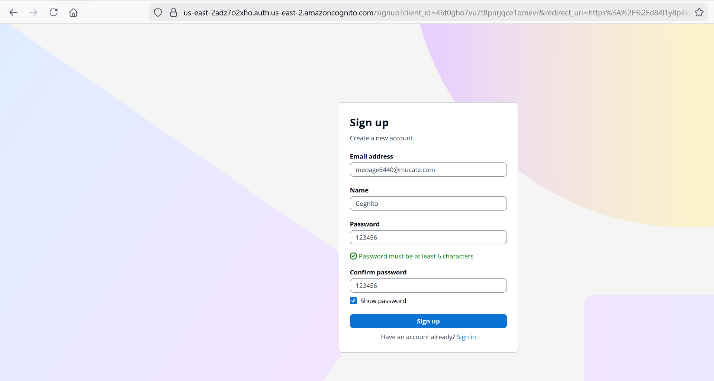

- Step-3: confirm account
    - enter the code received to the email
    - confirm account

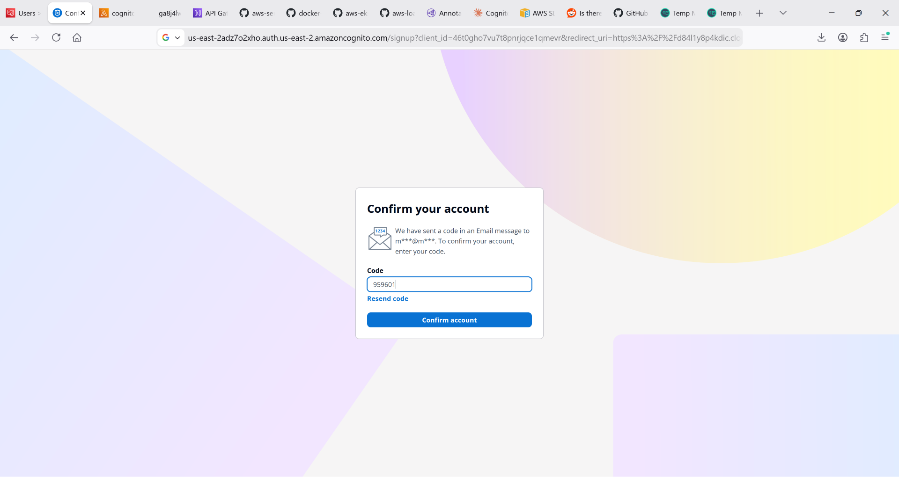

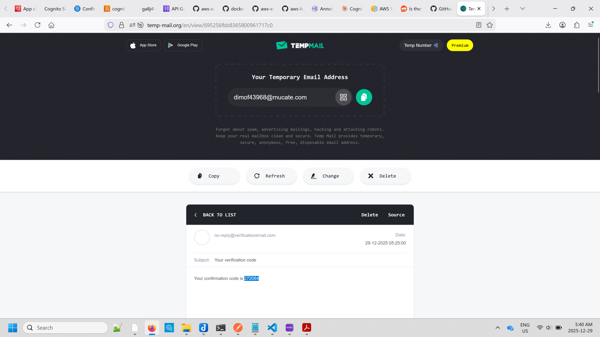

&nbsp;

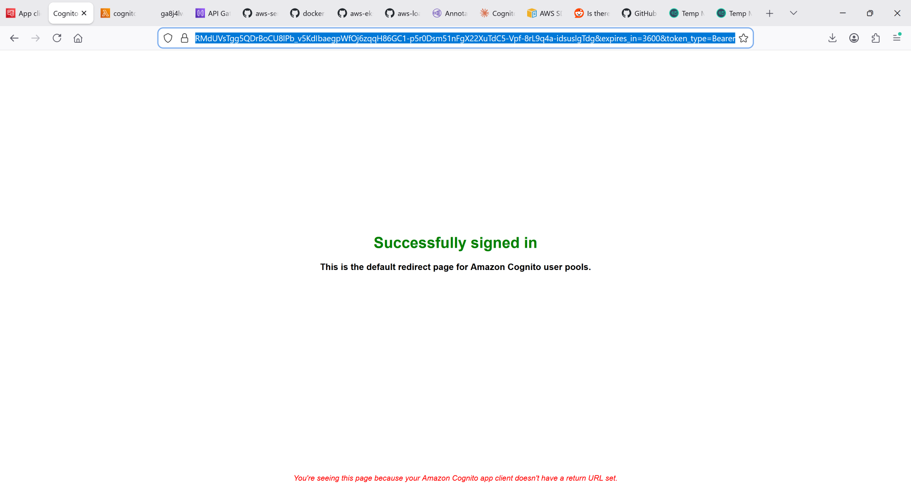

&nbsp;

- Step-4: Get Access token from the URL
    - copy the URL to editot
    - extract the access_token from the URL

```
https://d84l1y8p4kdic.cloudfront.net/#id_token=eyJraWQiOiJobTRaNjM5RytYeHZhSm5PWFlJTENTa0N5M2pPSnRiYWpwVVV5SUVqRW9VPSIsImFsZyI6IlJTMjU2In0.eyJhdF9oYXNoIjoiQnRLWF8zUzdrUzItajI0b09WbjVaZyIsInN1YiI6ImYxZWI5NTMwLTIwYTEtNzBiMS1iNjljLTY5MDYyMWRlNDUzOSIsImVtYWlsX3ZlcmlmaWVkIjp0cnVlLCJpc3MiOiJodHRwczpcL1wvY29nbml0by1pZHAudXMtZWFzdC0yLmFtYXpvbmF3cy5jb21cL3VzLWVhc3QtMl9BRFo3TzJ4aG8iLCJjb2duaXRvOnVzZXJuYW1lIjoiZjFlYjk1MzAtMjBhMS03MGIxLWI2OWMtNjkwNjIxZGU0NTM5IiwiYXVkIjoiNDZ0MGdobzd2dTd0OHBucmpxY2UxcW1ldnIiLCJldmVudF9pZCI6IjU0MjNjOWFjLThlZDYtNGZhZi05NmZhLTU2MzcwYTE5MDk3MiIsInRva2VuX3VzZSI6ImlkIiwiYXV0aF90aW1lIjoxNzY3MDAzOTIzLCJleHAiOjE3NjcwMDc1MjMsImlhdCI6MTc2NzAwMzkyMywianRpIjoiM2IwNjRhNGYtYzI2OS00NTY2LWE4ZWUtOWEzOWM4MzE2MGNjIiwiZW1haWwiOiJkaW1vZjQzOTY4QG11Y2F0ZS5jb20ifQ.mnvAt1KLqpfR0sLm3smQbW80ASgu0aeBau5s0uWMRHR5S4IC__v5GRsVkaoaM0CPW0mkR8DXYxN7B92jy1rfgc39i-mHlzjxpxHYe8FgwMsOHRM4TlJjk5G79AdzvCL5Eyl-pnFB_-nW-55t-8SN4L_XAbNdhkP3PDFB5k_9kWtv4uSpGv7hEM0W2EJzZQU1TotyKEPKIAdSHmkzgLoYQFrG1_19UxexMa1cllyfP-9klz_m410-MHVyyO4tqfcyBN6xYEhRIXeN4Iat5DD6c7PxrWVaGDSCxcTaqtuy7ujtViUGaePgQfmIOWaaGoFTN-bJ2IC-EVsHNKXeyqewLQ&access_token=eyJraWQiOiJMZGcrYlN1VUpJdXhNZUtNdDQxZ0NUZkkyZXZzK0lLVk9kd1ZtZGZ5dUZBPSIsImFsZyI6IlJTMjU2In0.eyJzdWIiOiJmMWViOTUzMC0yMGExLTcwYjEtYjY5Yy02OTA2MjFkZTQ1MzkiLCJpc3MiOiJodHRwczpcL1wvY29nbml0by1pZHAudXMtZWFzdC0yLmFtYXpvbmF3cy5jb21cL3VzLWVhc3QtMl9BRFo3TzJ4aG8iLCJ2ZXJzaW9uIjoyLCJjbGllbnRfaWQiOiI0NnQwZ2hvN3Z1N3Q4cG5yanFjZTFxbWV2ciIsImV2ZW50X2lkIjoiNTQyM2M5YWMtOGVkNi00ZmFmLTk2ZmEtNTYzNzBhMTkwOTcyIiwidG9rZW5fdXNlIjoiYWNjZXNzIiwic2NvcGUiOiJwaG9uZSBvcGVuaWQgZW1haWwiLCJhdXRoX3RpbWUiOjE3NjcwMDM5MjMsImV4cCI6MTc2NzAwNzUyMywiaWF0IjoxNzY3MDAzOTIzLCJqdGkiOiJkZjk5NTkwNi0yNjhlLTQ5NDAtOTFiZS0wZjI0MWM5MjViOGUiLCJ1c2VybmFtZSI6ImYxZWI5NTMwLTIwYTEtNzBiMS1iNjljLTY5MDYyMWRlNDUzOSJ9.SZMXBnsmZZaNmKApOoCu8v8mJewlo1cOeDSMJRuTOJvOq-QDmDPFsC9b5XPJNF7Abn6jhI-pfXlcXektKwRW4Vy6Pl2JI5AFzSApUgUz-1dfTHs0BNDR_IgjOeCuD7LCNH033bNzO_F4cWe_jzqmUrNEIIixOzvbCYB7SoEwPHiYI8t3kjtJrQYf5WnNuPcia3iXnmgFYxuQoeScbRP-mk31c57ADIBm1D6Al8D7vGkEFVF42m9ddZa0nETRMdUVsTgg5QDrBoCU8lPb_v5KdIbaegpWfOj6zqqH86GC1-p5r0Dsm51nFgX22XuTdC5-Vpf-8rL9q4a-idsuslgTdg&expires_in=3600&token_type=Bearer
```

&nbsp;

```
https://d84l1y8p4kdic.cloudfront.net/#

id_token=eyJraWQiOiJobTRaNjM5RytYeHZhSm5PWFlJTENTa0N5M2pPSnRiYWpwVVV5SUVqRW9VPSIsImFsZyI6IlJTMjU2In0.eyJhdF9oYXNoIjoiQnRLWF8zUzdrUzItajI0b09WbjVaZyIsInN1YiI6ImYxZWI5NTMwLTIwYTEtNzBiMS1iNjljLTY5MDYyMWRlNDUzOSIsImVtYWlsX3ZlcmlmaWVkIjp0cnVlLCJpc3MiOiJodHRwczpcL1wvY29nbml0by1pZHAudXMtZWFzdC0yLmFtYXpvbmF3cy5jb21cL3VzLWVhc3QtMl9BRFo3TzJ4aG8iLCJjb2duaXRvOnVzZXJuYW1lIjoiZjFlYjk1MzAtMjBhMS03MGIxLWI2OWMtNjkwNjIxZGU0NTM5IiwiYXVkIjoiNDZ0MGdobzd2dTd0OHBucmpxY2UxcW1ldnIiLCJldmVudF9pZCI6IjU0MjNjOWFjLThlZDYtNGZhZi05NmZhLTU2MzcwYTE5MDk3MiIsInRva2VuX3VzZSI6ImlkIiwiYXV0aF90aW1lIjoxNzY3MDAzOTIzLCJleHAiOjE3NjcwMDc1MjMsImlhdCI6MTc2NzAwMzkyMywianRpIjoiM2IwNjRhNGYtYzI2OS00NTY2LWE4ZWUtOWEzOWM4MzE2MGNjIiwiZW1haWwiOiJkaW1vZjQzOTY4QG11Y2F0ZS5jb20ifQ.mnvAt1KLqpfR0sLm3smQbW80ASgu0aeBau5s0uWMRHR5S4IC__v5GRsVkaoaM0CPW0mkR8DXYxN7B92jy1rfgc39i-mHlzjxpxHYe8FgwMsOHRM4TlJjk5G79AdzvCL5Eyl-pnFB_-nW-55t-8SN4L_XAbNdhkP3PDFB5k_9kWtv4uSpGv7hEM0W2EJzZQU1TotyKEPKIAdSHmkzgLoYQFrG1_19UxexMa1cllyfP-9klz_m410-MHVyyO4tqfcyBN6xYEhRIXeN4Iat5DD6c7PxrWVaGDSCxcTaqtuy7ujtViUGaePgQfmIOWaaGoFTN-bJ2IC-EVsHNKXeyqewLQ&

access_token=eyJraWQiOiJMZGcrYlN1VUpJdXhNZUtNdDQxZ0NUZkkyZXZzK0lLVk9kd1ZtZGZ5dUZBPSIsImFsZyI6IlJTMjU2In0.eyJzdWIiOiJmMWViOTUzMC0yMGExLTcwYjEtYjY5Yy02OTA2MjFkZTQ1MzkiLCJpc3MiOiJodHRwczpcL1wvY29nbml0by1pZHAudXMtZWFzdC0yLmFtYXpvbmF3cy5jb21cL3VzLWVhc3QtMl9BRFo3TzJ4aG8iLCJ2ZXJzaW9uIjoyLCJjbGllbnRfaWQiOiI0NnQwZ2hvN3Z1N3Q4cG5yanFjZTFxbWV2ciIsImV2ZW50X2lkIjoiNTQyM2M5YWMtOGVkNi00ZmFmLTk2ZmEtNTYzNzBhMTkwOTcyIiwidG9rZW5fdXNlIjoiYWNjZXNzIiwic2NvcGUiOiJwaG9uZSBvcGVuaWQgZW1haWwiLCJhdXRoX3RpbWUiOjE3NjcwMDM5MjMsImV4cCI6MTc2NzAwNzUyMywiaWF0IjoxNzY3MDAzOTIzLCJqdGkiOiJkZjk5NTkwNi0yNjhlLTQ5NDAtOTFiZS0wZjI0MWM5MjViOGUiLCJ1c2VybmFtZSI6ImYxZWI5NTMwLTIwYTEtNzBiMS1iNjljLTY5MDYyMWRlNDUzOSJ9.SZMXBnsmZZaNmKApOoCu8v8mJewlo1cOeDSMJRuTOJvOq-QDmDPFsC9b5XPJNF7Abn6jhI-pfXlcXektKwRW4Vy6Pl2JI5AFzSApUgUz-1dfTHs0BNDR_IgjOeCuD7LCNH033bNzO_F4cWe_jzqmUrNEIIixOzvbCYB7SoEwPHiYI8t3kjtJrQYf5WnNuPcia3iXnmgFYxuQoeScbRP-mk31c57ADIBm1D6Al8D7vGkEFVF42m9ddZa0nETRMdUVsTgg5QDrBoCU8lPb_v5KdIbaegpWfOj6zqqH86GC1-p5r0Dsm51nFgX22XuTdC5-Vpf-8rL9q4a-idsuslgTdg

&expires_in=3600&token_type=Bearer
```

* * *

* * *

&nbsp;

(7) Test API

- - Send GET API Request  to the "Invoke URL"
        - Add "Authorization" header
        - Paste access_token as value

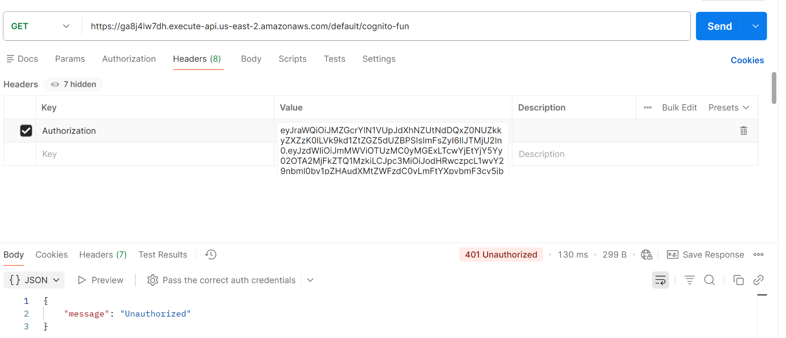

- Result : "Hello from Lambda!"

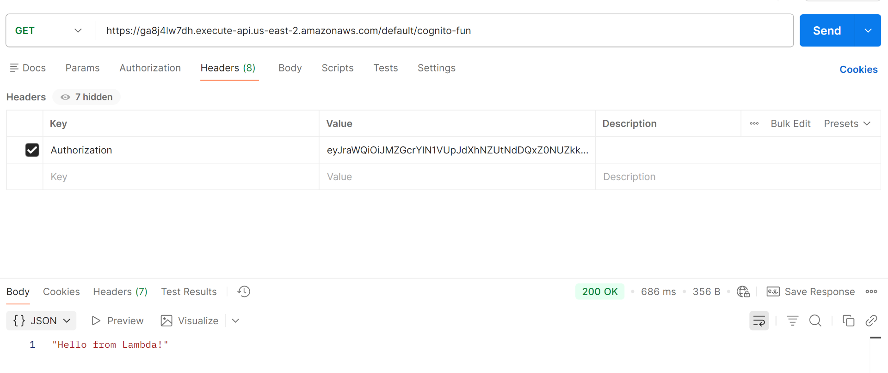