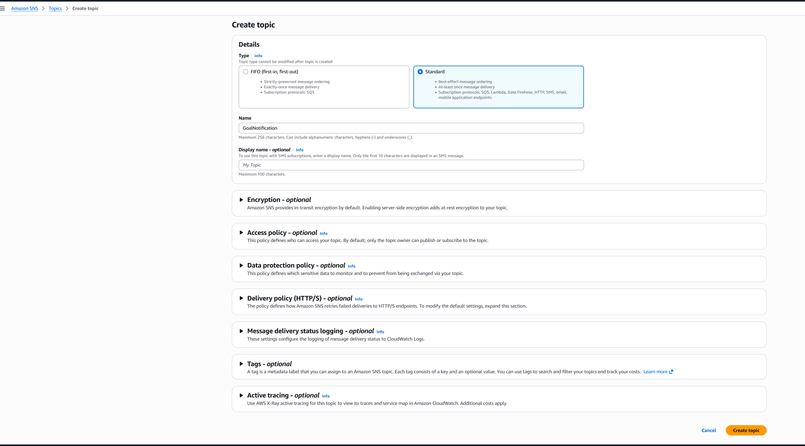
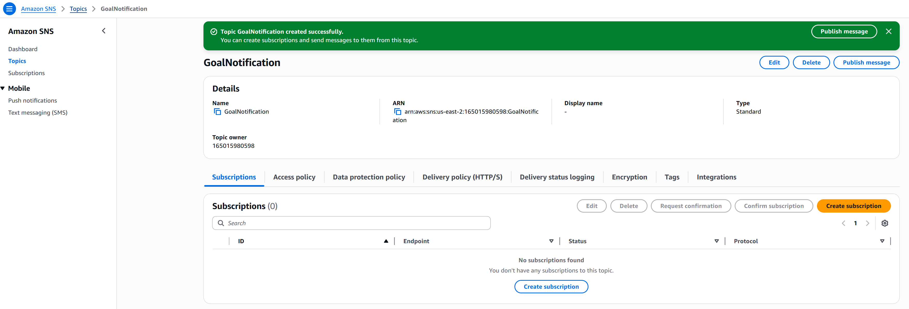
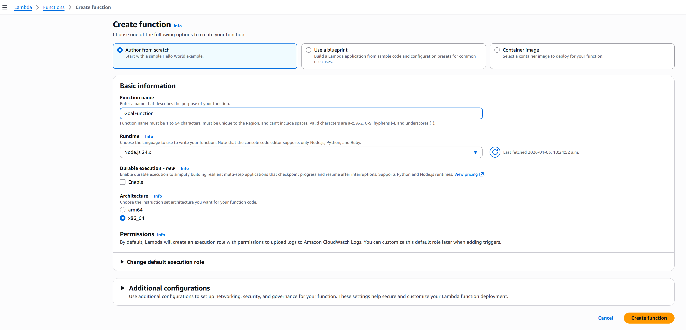
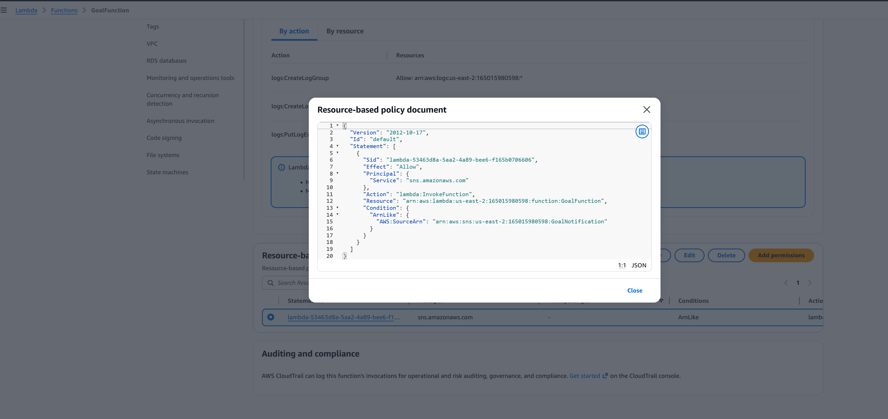
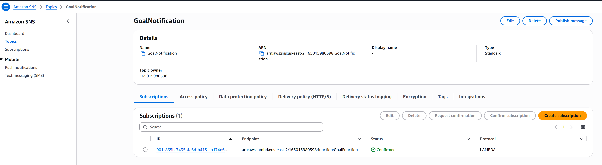
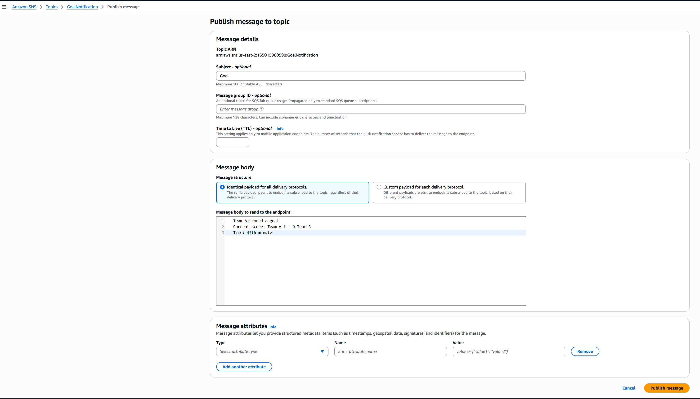
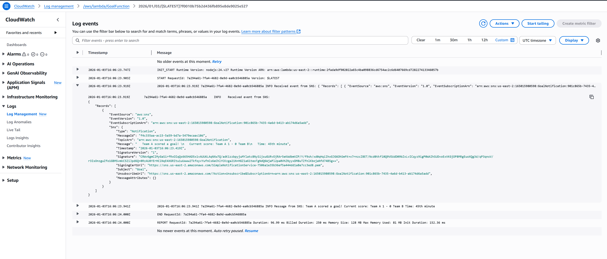

# AWS SNS and Lambda Integration Lab

## Lab Overview
In this hands-on lab, you will learn how to integrate Amazon SNS (Simple Notification Service) with AWS Lambda to build an event-driven notification system. You'll create a football goal notification system where SNS publishes messages that trigger Lambda functions automatically.

**Use Case:** Football application that sends goal notifications through SNS, which are automatically processed by Lambda functions.

---

## Prerequisites
- AWS Account with appropriate permissions
- Basic understanding of AWS SNS and Lambda
- AWS Management Console access

---

## Lab Objectives
By the end of this lab, you will be able to:
- Create an SNS topic for notifications
- Create a Lambda function
- Subscribe Lambda to an SNS topic
- Configure Lambda permissions for SNS invocation
- Publish messages to SNS
- Monitor Lambda executions in CloudWatch

---

## Part 1: Create Amazon SNS Topic

### Step 1: Create New Topic

Open  **Simple Notification Service**

1. Click on **Topics** in the left navigation
2. Click **Create topic** button
3. Select **Standard** type
4. Enter Topic name: `GoalNotification`
5. Leave other settings as default
6. Click **Create topic**



---

### Step 2: View Topic Details

**Note the following:**
- Topic ARN: `arn:aws:sns:us-east-1:123456789012:GoalNotification`
- Topic name: `GoalNotification`
- Type: Standard



---

## Part 2: Create Lambda Function

### Step 1: Create Lambda Function

Open  **Lamnda Service**

1. Click **Create function**
2. Select **Author from scratch**
3. Function name: `GoalFunction`
4. Runtime: **Node.js** (latest version)
5. Leave other settings as default
6. Click **Create function**


---

### Step 2: Check Asynchronous Invocation Settings

1. Go to **Configuration** tab
2. Click **Asynchronous invocation**
3. Review settings:
   - Retry attempts: **2**
   - Maximum age of event: **6 hours**

**Note:** SNS invokes Lambda asynchronously, so these settings apply.

---

### Step 3: Review Permissions (Before Subscription)

1. Go to **Configuration** tab
2. Click **Permissions**
3. Scroll to **Resource-based policy statements**
4. Currently: **No resource-based policy** (empty)

---

## Part 3: Subscribe Lambda to SNS Topic

### Method 1: From SNS Console

1. Go to **SNS Console**
2. Open **GoalNotification** topic
3. Go to **Subscriptions** tab
4. Click **Create subscription**
5. Select Protocol: **AWS Lambda**
6. Select Endpoint: **GoalFunction**
7. Click **Create subscription**

---

### Method 2: From Lambda Console (Recommended)

1. Go to **Lambda Console**
2. Open **GoalFunction**
3. Click **Add trigger**
4. Select: **SNS**
5. Choose SNS topic: **GoalNotification**
6. Click **Add**

**Important:** in this method, Lambda automatically adds required permissions for SNS to invoke the function.


---

### Step 2: Verify Resource-Based Policy

1. Go to **Configuration** → **Permissions**
2. Scroll to **Resource-based policy statements**
3. You should now see a policy statement
4. Click to view details

**Policy allows:** SNS topic `GoalNotification` to invoke Lambda function `GoalFunction`


---

### Step 3: Confirm Subscription in SNS

1. Go to **SNS Console**
2. Open **GoalNotification** topic
3. Go to **Subscriptions** tab
4. Status should be: **Confirmed**
5. Protocol: **LAMBDA**
6. Endpoint: Lambda function ARN



---

## Part 4: Develop Lambda Function Code

### Step 1: Understand SNS Event Format

Create a test event to see the structure:

1. Go to **Lambda Console**
2. Open **GoalFunction**
3. Go to **Test** tab
4. Leave other settings as default
5. In **Template - optional** , choose **SNS Topic Notification**
6. In **Event JSON** , notice below SNS Event sample

**Sample SNS Event JSON:**
```json
{
  "Records": [
    {
      "EventSource": "aws:sns",
      "EventVersion": "1.0",
      "EventSubscriptionArn": "arn:aws:sns:us-east-1:{{{accountId}}}:ExampleTopic",
      "Sns": {
        "Type": "Notification",
        "MessageId": "95df01b4-ee98-5cb9-9903-4c221d41eb5e",
        "TopicArn": "arn:aws:sns:us-east-1:123456789012:ExampleTopic",
        "Subject": "example subject",
        "Message": "example message",
        "Timestamp": "1970-01-01T00:00:00.000Z",
        "SignatureVersion": "1",
        "Signature": "EXAMPLE",
        "SigningCertUrl": "EXAMPLE",
        "UnsubscribeUrl": "EXAMPLE",
        "MessageAttributes": {
          "Test": {
            "Type": "String",
            "Value": "TestString"
          },
          "TestBinary": {
            "Type": "Binary",
            "Value": "TestBinary"
          }
        }
      }
    }
  ]
}
```
**Important:** Every SNS message will be a array element in "Records" array of Event
---

### Step 2: Write Lambda Function Code

1. Go to **Lambda Console**
2. Open **GoalFunction**
3. Go to **Code** tab
4. Update code
5. Click **Deploy** button

**File:** `index.js`

```javascript
export const handler = async (event) => {
    // Log the entire incoming event from SNS
    console.log('Received event from SNS:', JSON.stringify(event, null, 2));

    // Extract message from SNS event
    const message = event.Records[0].Sns.Message;

    // Log the message
    console.log('Message from SNS:', message);
};
```
---

## Part 5: Test the Integration

### Step 1: Publish Message from SNS


1. Go to **SNS Console**
2. Open **GoalNotification** topic
3. Click **Publish message** button
    1. Subject: `Goal`
    2. Message body:
    ```
    Team A scored a goal!
    Current score: Team A 1 - 0 Team B
    Time: 45th minute
    ```
    3. Leave other settings as default
    4. Click **Publish message**


---

### Step 2: Verify Message Published

Success message should appear:
- "Message published to topic GoalNotification successfully."
- Message ID & Request ID displayed

---

### Step 3: Check Lambda Execution

1. Go to **Lambda Console**
2. Open **GoalFunction**
3. Click **Monitor** tab
4. Click **View CloudWatch logs**

---

### Step 4: View CloudWatch Logs

1. Click on the latest **Log stream**
2. Review the logs:
   - Full event JSON from SNS
   - Extracted message
   - Execution details



**Received event from SNS:**
```
{
    "Records": [
        {
            "EventSource": "aws:sns",
            "EventVersion": "1.0",
            "EventSubscriptionArn": "arn:aws:sns:us-east-2:165015980598:GoalNotification:901c865b-7435-4a6d-b413-ab174d6a5add",
            "Sns": {
                "Type": "Notification",
                "MessageId": "f4c335aa-ac15-5a59-bd7a-5479ecaac10d",
                "TopicArn": "arn:aws:sns:us-east-2:165015980598:GoalNotification",
                "Message": "   Team A scored a goal! \n   Current score: Team A 1 - 0 Team B\n   Time: 45th minute",
                "Timestamp": "2026-01-03T16:06:23.419Z",
                "SignatureVersion": "1",
                "Signature": "{Signature}",
                "SigningCertUrl": "{URL}",
                "Subject": "Goal",
                "UnsubscribeUrl": "https://sns.us-east-2.amazonaws.com/?Action=Unsubscribe&SubscriptionArn=arn:aws:sns:us-east-2:165015980598:GoalNotification:901c865b-7435-4a6d-b413-ab174d6a5add",
                "MessageAttributes": {}
            }
        }
    ]
}

```

---

## Part 6: Cleanup Resources

### Step 1: Delete SNS Topic

1. Go to **SNS Console**
2. Select **GoalNotification** topic
3. Click **Delete**
4. Type `delete me` to confirm
5. Click **Delete**

---

### Step 2: Delete Lambda Function

1. Go to **Lambda Console**
2. Select **GoalFunction**
3. Click **Actions** → **Delete**
4. Type `delete` to confirm
5. Click **Delete**

---

### Step 3: Delete Cloudwatch Log Group

1. Go to **CloudWatch Console**
2. Select **Logs** → **Log Management** in the left panel
3. Select the **Log Group** related to Lambda function listed in the right panel
4. Select **Actions** → **Delete Log groups**

---

## Key Concepts

### SNS Asynchronous Invocation
- SNS invokes Lambda **asynchronously**
- Lambda doesn't wait for response
- Events are queued and retried on failure
- Default: 2 retry attempts

### Resource-Based Policy
- Required for SNS to invoke Lambda
- Automatically created when adding SNS trigger
- Grants `lambda:InvokeFunction` permission
- Scoped to specific SNS topic ARN

### Event Structure
- Events contain `Records` array
- Each record has SNS metadata
- Message content in `Sns.Message`
- Subject in `Sns.Subject`

---

## Next Steps

1. Save notifications to DynamoDB table
2. Send processed data to SQS queue
3. Filter messages based on content
4. Integrate with API Gateway
5. Send alerts via email or SMS

---

## Additional Resources

### AWS Documentation
- [Amazon SNS Developer Guide](https://docs.aws.amazon.com/sns/latest/dg/)
- [AWS Lambda Developer Guide](https://docs.aws.amazon.com/lambda/latest/dg/)
- [Using Lambda with SNS](https://docs.aws.amazon.com/lambda/latest/dg/with-sns.html)

---

## Lab Summary

**Lab Duration:** 45-60 minutes  
**Difficulty Level:** Beginner  
**AWS Services Used:** SNS, Lambda, CloudWatch  
**Last Updated:** January 2026  

---
