# AWS Serverless Fanout Architecture Lab - Complete Guide

## Lab Overview
In this comprehensive hands-on lab, you will build a complete production-ready serverless fanout architecture using Amazon SNS, Amazon SQS, AWS Lambda, API Gateway, and DynamoDB. You'll create an e-commerce order processing system that demonstrates event-driven microservices architecture with message filtering.

**Use Case:** E-commerce order processing system where placing an order triggers multiple independent microservices (Order Acknowledgment, Inventory Management, Notification, and Shipment Processing) through a pub/sub fanout pattern with intelligent message filtering.

---

## Prerequisites
- AWS Account with appropriate permissions
- Node.js 18.x or higher installed locally
- Visual Studio Code or similar IDE
- Basic understanding of AWS Lambda, SNS, SQS, DynamoDB, and API Gateway
- Postman or similar API testing tool
- Understanding of pub/sub (publish/subscribe) pattern
- Familiarity with JavaScript/Node.js

---

## Lab Objectives
By the end of this lab, you will be able to:
- Design and implement serverless fanout architecture
- Create API Gateway with Lambda proxy integration
- Develop multiple Lambda microservices with proper separation of concerns
- Configure DynamoDB tables for multiple microservices
- Implement SNS topic for event publishing
- Create multiple SQS queues for different microservices
- Subscribe SQS queues to SNS topic
- Configure IAM permissions for all services
- Set up event source mapping from SQS to Lambda
- Configure SQS access policies for SNS message delivery
- Develop Lambda functions to process nested JSON messages
- Deploy Node.js applications to AWS Lambda
- Implement SNS subscription filter policies for selective message routing
- Test complete end-to-end flow
- Monitor and debug using CloudWatch Logs
- Clean up all AWS resources

---

## Architecture Overview

```
Client Application
    ↓ (HTTP POST)
API Gateway (/order)
    ↓ (Synchronous invocation)
Order Acknowledgment Lambda
    ├─→ DynamoDB (Orders Table)
    └─→ SNS Topic (OrderTopic) [Publish]
            ↓ ↓ ↓ (Fanout with filters)
            ├─→ Inventory Queue [Filter: type="shipment requirement"] → Inventory Lambda → Inventory Table
            ├─→ Notification Queue [No filter] → Notification Lambda
            └─→ Shipment Queue [No filter] → Shipment Lambda
```

**Complete Event Flow:**
1. Client sends POST request with order JSON to API Gateway
2. API Gateway invokes Order Acknowledgment Lambda (synchronous)
3. Order Acknowledgment Lambda:
   - Generates unique order ID (UUID)
   - Saves order to DynamoDB Orders table
   - Publishes message to SNS OrderTopic
   - Returns synchronous response to client
4. SNS evaluates subscription filter policies
5. SNS delivers message to subscribed SQS queues (fanout)
6. Lambda functions poll their respective SQS queues (event source mapping)
7. Each microservice processes order independently:
   - **Inventory**: Saves to Inventory table (only if type="shipment requirement")
   - **Notification**: Sends customer notifications
   - **Shipment**: Initiates shipping process

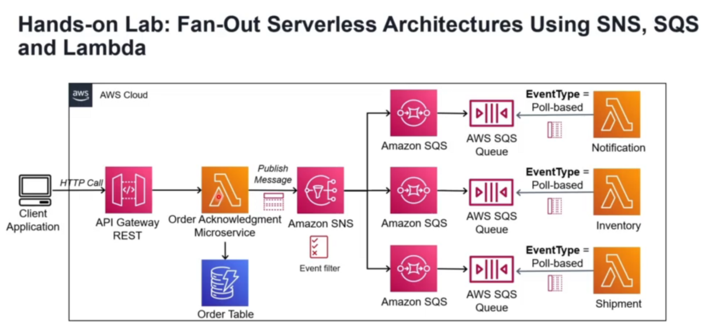

---

## Part 1: Infrastructure Setup

### Step 1: Create Order Acknowledgment Lambda Function

**IAM Permissions Required:**
- `sns:Publish` - Publish messages to SNS topic
- `dynamodb:PutItem` - Insert order into Orders table
- `logs:CreateLogGroup`, `logs:CreateLogStream`, `logs:PutLogEvents` - CloudWatch logging

Open **Lambda Service**

1. Click **Create function**
2. Select **Author from scratch**
3. Function name: `OrderAcknowledgment`
4. Runtime: **Node.js 20.x** (or latest)
5. Expand **Change default execution role**
6. Select: **Create a new role from AWS policy templates**
7. Role name: `OrderAcknowledgmentRole`
8. Policy templates:
   - Search and select: **Amazon SNS publish policy**
   - Search and select: **Simple microservice permissions** (includes DynamoDB)
9. Click **Create function**

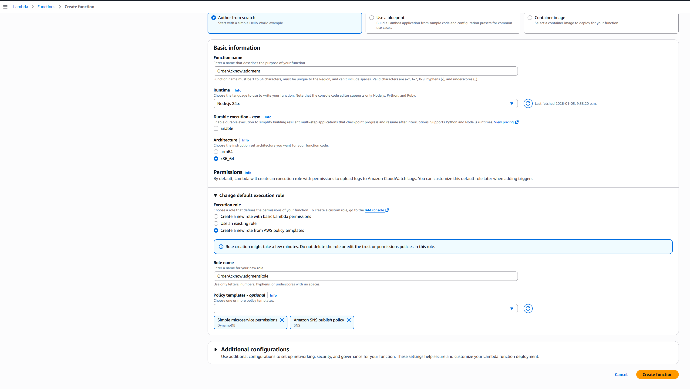

**Why These Permissions?**
- Order Acknowledgment needs to publish to SNS after receiving order
- Must save order to DynamoDB for persistence
- SNS publish permission prevents authorization errors
- Setting permissions during creation is AWS best practice

---

### Step 2: Create Inventory Lambda Function

**IAM Permissions Required:**
- `sqs:ReceiveMessage` - Poll messages from Inventory Queue
- `sqs:DeleteMessage` - Delete processed messages
- `sqs:GetQueueAttributes` - Get queue metadata
- `dynamodb:PutItem` - Save inventory records
- CloudWatch logging permissions

1. Click **Create function**
2. Select **Author from scratch**
3. Function name: `InventoryMicroservice`
4. Runtime: **Node.js 20.x**
5. Expand **Change default execution role**
6. Select: **Create a new role from AWS policy templates**
7. Role name: `InventoryMicroserviceRole`
8. Policy templates:
   - **Amazon SQS poller permissions**
9. Click **Create function**


**Note:** We'll add DynamoDB permissions later when we create the table.

---

### Step 3: Create Notification Lambda Function

1. Click **Create function**
2. Function name: `NotificationMicroservice`
3. Runtime: **Node.js 20.x**
4. Role name: `NotificationMicroserviceRole`
5. Policy templates: **Amazon SQS poller permissions**
6. Click **Create function**


---

### Step 4: Create Shipment Lambda Function

1. Click **Create function**
2. Function name: `ShipmentMicroservice`
3. Runtime: **Node.js 20.x**
4. Role name: `ShipmentMicroserviceRole`
5. Policy templates: **Amazon SQS poller permissions**
6. Click **Create function**

**Verification:** You should now have 4 Lambda functions with appropriate IAM roles.

---

### Step 5: Create API Gateway

Open **API Gateway Service**

1. Click **Create API**
2. Select **REST API** (not private)
3. Click **Build**
4. Select **New API**
5. API name: `OrderAPI`
6. Description: `API for e-commerce order processing`
7. Endpoint Type: **Regional**
8. Security policy : **SecurityPolicy_TLS13_1_2_2021_06**
9. Click **Create API**

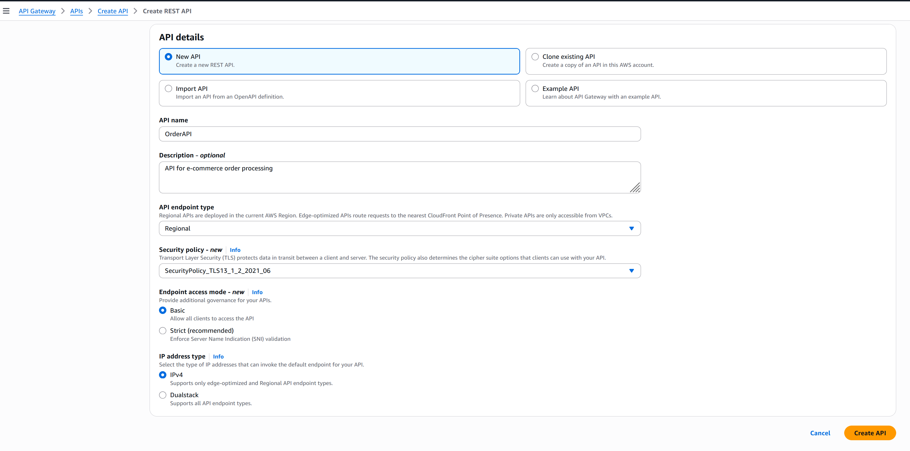

---

### Step 6: Create Resource and Method

**Create Resource:**
1. Click **Create Resource**
2. Resource Name: `order`
3. Click **Create Resource**

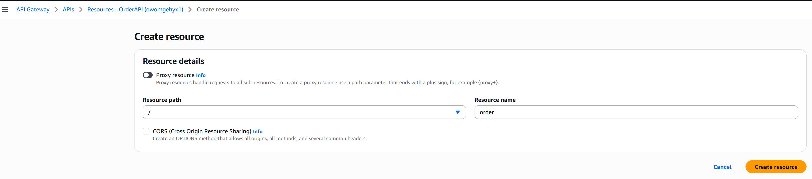


**Create POST Method:**
1. Select the `/order` resource
2. Click **Create Method**
3. Method type: Select **POST** from dropdown
4. Configure integration:
   - Integration type: **Lambda Function**
   - ✅ Check **Use Lambda Proxy Integration**
   - Lambda Region: your region
   - Lambda Function: `OrderAcknowledgment`
6. Click **Create method**

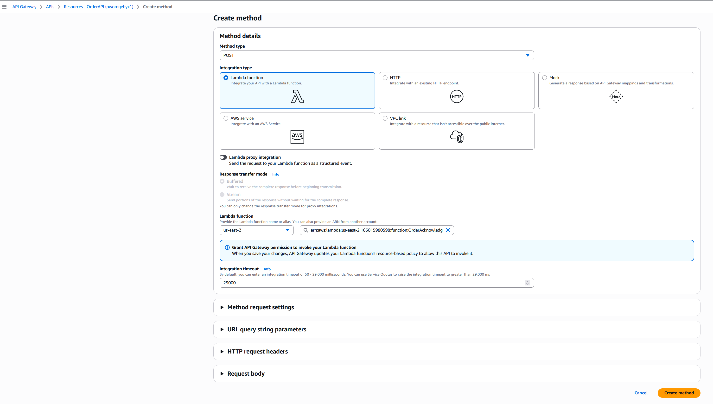
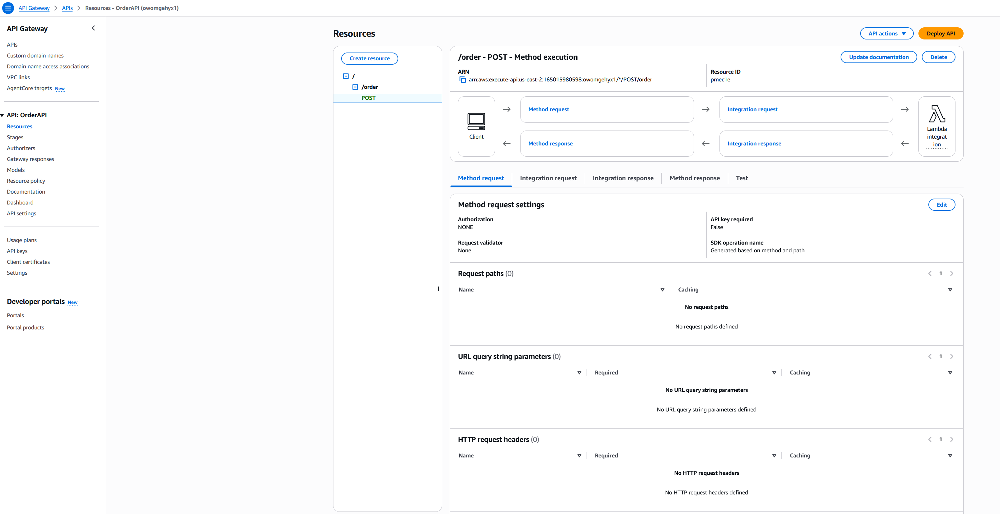
**Lambda Proxy Integration:** Passes entire HTTP request to Lambda, including headers, body, query parameters.

---

### Step 7: Deploy API

1. Click **Deploy API** (**Note**: if "Deploy API" not enabled ,reload current page. )
2. Stage: **[New Stage]**
3. Stage name: `prod`
4. Click **Deploy**
5. Copy the **Invoke URL** for testing

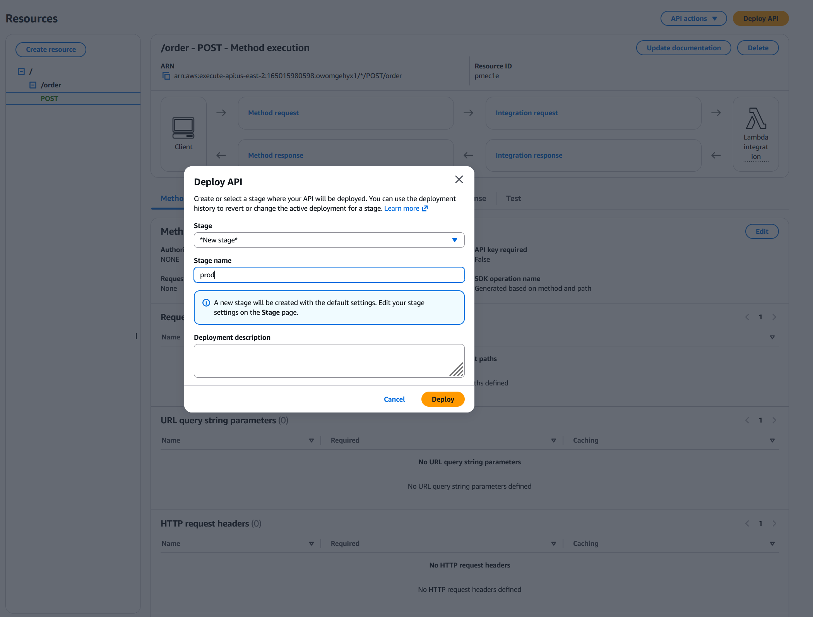
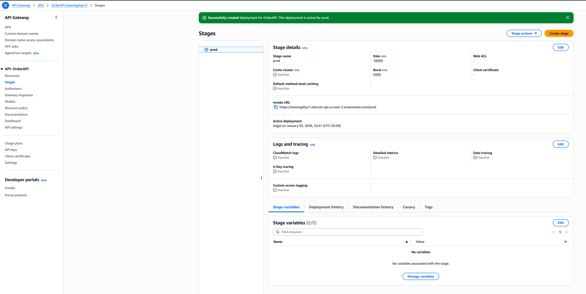


---

### Step 8: Test API (Initial)

1. Open **Postman**
2. Create POST request
3. URL: Your API Invoke URL + `/order`
4. Body (raw JSON):
```json
{
  "customerId": "CUST-001",
  "items": "Apple IPhone 16",
  "type": "test"
}
```
6. Click **Send**

**Expected:** Basic Lambda response (function not yet developed)

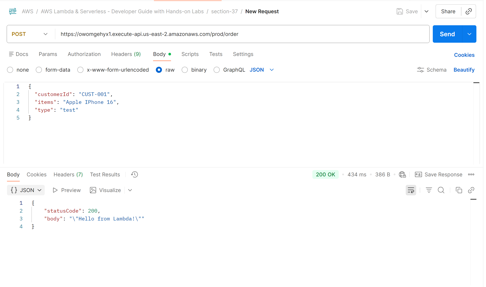

---

### Step 9: Create DynamoDB Tables

**Create Orders Table:**

1. Go to **DynamoDB Console**
2. Click **Create table**
3. Table name: `Orders`
4. Partition key: `id` (String)
5. Table settings: **Default settings**
6. Click **Create table**

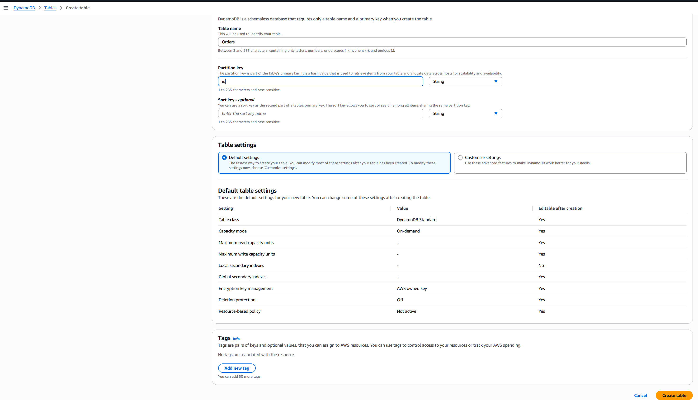

**Create Inventory Table:**

1. Click **Create table**
2. Table name: `Inventory`
3. Partition key: `code` (String)
4. Table settings: **Default settings**
5. Click **Create table**

**Wait:** Both tables must be **Active** before proceeding

---

### Step 10: Create SQS Queues

Open **Simple Queue Service**

**Create Inventory Queue:**
1. Click **Create queue**
2. Type: **Standard**
3. Name: `InventoryQueue`
4. Configuration: Leave all defaults
5. Click **Create queue**


**Create Notification Queue:**
1. Click **Create queue**
2. Type: **Standard**
3. Name: `NotificationQueue`
4. Configuration: Leave all defaults
5. Click **Create queue**

**Create Shipment Queue:**
1. Click **Create queue**
2. Type: **Standard**
3. Name: `ShipmentQueue`
4. Configuration: Leave all defaults
5. Click **Create queue**


**Verification:** Three queues created with 0 messages

---

### Step 11: Add SQS Triggers to Lambda Functions

**Add Trigger to Inventory Lambda:**
1. Go to **Lambda Console**
2. Open **InventoryMicroservice**
3. Click **Add trigger**
4. Select: **SQS**
5. SQS queue: **InventoryQueue**
6. Batch size: **10**
7. Batch window: **0** seconds
8. Click **Add**

**Add Trigger to Notification Lambda:**
1. Open **NotificationMicroservice**
2. Click **Add trigger**
3. Select: **SQS**
4. SQS queue: **NotificationQueue**
5. Batch size: **10**
6. Click **Add**

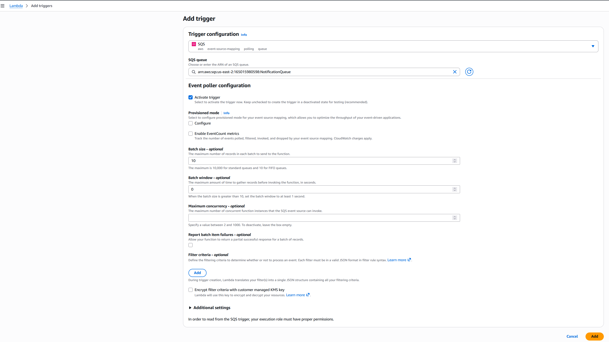

**Add Trigger to Shipment Lambda:**
1. Open **ShipmentMicroservice**
2. Click **Add trigger**
3. Select: **SQS**
4. SQS queue: **ShipmentQueue**
5. Batch size: **10**
6. Click **Add**

**Verification:** All Lambda functions should show SQS triggers in Configuration → Triggers

---

### Step 12: Create SNS Topic

Open **Simple Notification Service**

1. Click **Create topic**
2. Type: **Standard**
4. Name: `OrderTopic`
5. Display name: `Order Processing Topic`
6. Click **Create topic**

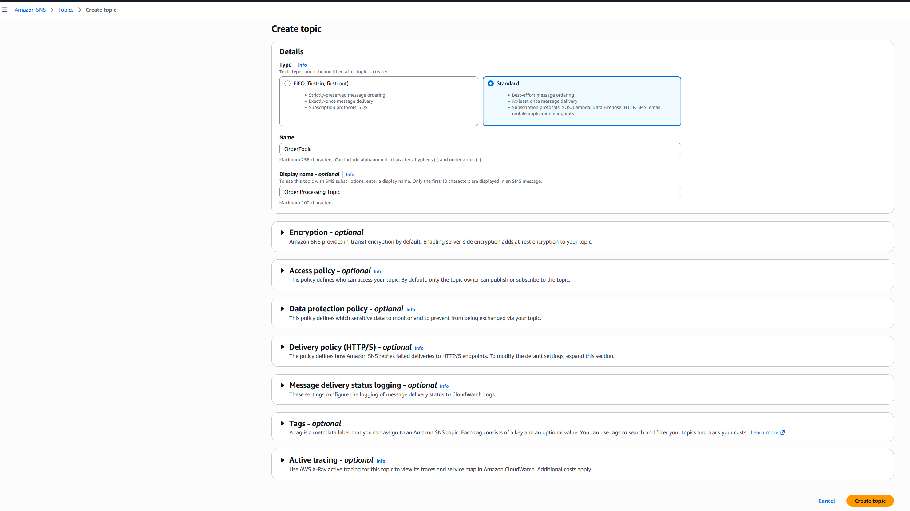

---

### Step 13: Copy SNS Topic ARN

1. In the topic details page, copy the **ARN**
2. Format: `arn:aws:sns:region:account-id:OrderTopic`
3. Save this for later use in Lambda environment variables


---

### Step 14: Subscribe SQS Queues to SNS Topic

**Subscribe Inventory Queue:**
1. In SNS Console, open **OrderTopic**
2. Go to **Subscriptions** tab
3. Click **Create subscription**
4. Protocol: **Amazon SQS**
5. Endpoint: Select **InventoryQueue** ARN
6. Click **Create subscription**

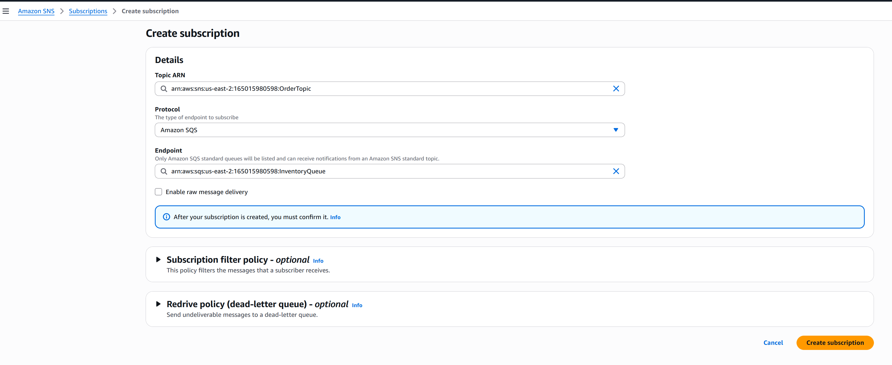
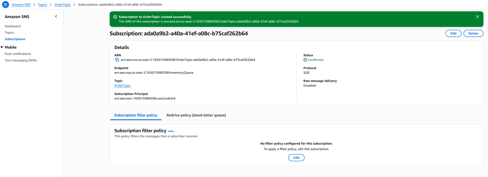

**Status:** Should show **Confirmed** immediately

**Subscribe Notification Queue:**
1. Click **Create subscription**
2. Protocol: **Amazon SQS**
3. Endpoint: **NotificationQueue** ARN
4. Click **Create subscription**

**Subscribe Shipment Queue:**
1. Click **Create subscription**
2. Protocol: **Amazon SQS**
3. Endpoint: **ShipmentQueue** ARN
4. Click **Create subscription**


**Verification:** Now OrderTopic(SNS) has Three SQS queue subscriptions, all **Confirmed**


---

### Step 15: Check and Verify SQS Access Policy for SNS

**Note:** SNS cannot send messages to SQS without explicit permission in SQS queue's access policy.This is required in addtion to adding SQS queue to SNS topic's subscription


**Edit Inventory Queue Policy:**
1. Go to **SQS Console**
2. Open **InventoryQueue**
3. Go to **Queue policies** tab
4. Check **Access Policy**

**Complete Policy Example:**
```json
{
  "Version": "2012-10-17",
  "Id": "__default_policy_ID",
  "Statement": [
    {
      "Sid": "__owner_statement",
      "Effect": "Allow",
      "Principal": {
        "AWS": "arn:aws:iam::165015980598:root"
      },
      "Action": "SQS:*",
      "Resource": "arn:aws:sqs:us-east-2:165015980598:NotificationQueue"
    },
    {
      "Sid": "topic-subscription-arn:aws:sns:us-east-2:165015980598:OrderTopic",
      "Effect": "Allow",
      "Principal": {
        "Service": "sns.amazonaws.com"
      },
      "Action": "SQS:SendMessage",
      "Resource": "arn:aws:sqs:us-east-2:165015980598:NotificationQueue",
      "Condition": {
        "ArnLike": {
          "aws:SourceArn": "arn:aws:sns:us-east-2:165015980598:OrderTopic"
        }
      }
    }
  ]
}
```

**The SQS Queue Access Policy** you see here is a permission policy that controls who can send messages to the SQS Queue (InventoryQueue) and under what conditions. It has two main sections (or "statements") that serve different purposes:

1. The first section is giving permissions to the root AWS account (the owner) to manage the queue and send or receive messages. This is standard to give the owner full control over the SQS queue.

2. The second section is allowing SNS (specifically the OrderTopic SNS topic) to send messages to the InventoryQueue. This is the permission that specifically ties the SNS topic to the SQS queue.

**Repeat the check for Notification Queue & Shipment Queue:**
1. Open the queue
2. Go to **Queue policies** tab
3. Check **Access Policy**

---

### Step 16: Test SNS to SQS Message Flow

**Edit Lambda code to log the received event**
1. Go to **Lamda Console**
2. Open **NotificationMicroservie**
3. Go to **Code** tab
4. Update code  ( just adding a line to log the received event)
5. **Deploy**
6. Repeat the steps 1-5 for **InventoryMicroservie** **ShipmentMicroservie**

**Complete Code Example:**
```json
export const handler = async (event) => {
  console.log("event:", JSON.stringify(event, undefined, 2));
  const response = {
    statusCode: 200,
    body: JSON.stringify('Hello from Lambda!'),
  };
  return response;
};
```

**Publish Messgae from SNS Topic**
1. Go to **SNS Console**
2. Open **OrderTopic**
3. Click **Publish message**
4. Subject: `Test Message`
5. Message body:
```json
{
  "orderId": "TEST-001",
  "type": "test"
}
```
6. Click **Publish message**

**Verify Message Delivery in CloudWatch**
1. Go to **Lambda Console**
2. Open **NotificationMicroservice**
3. Go to **Monitor** tab
4. Click **View CloudWatch logs**
5. In the opened **CloudWatch console** window , select and open the latest **log stream**
6. Verify that lambda function has recorded the event with message **published in SNS** in CloudWatch logs
7. Verify the Message published to SNS topic inside Records[n].body
8. Repeat the steps 1-7 for **InventoryMicroservice** **ShipmentMicroservice**

**Complete CloudWatch log for the Event**
```
2026-01-06T05:49:40.704Z	09fbed16-8ba6-52bf-9484-8cc02f02c68f	INFO	event:
{
    "Records": [
        {
            "messageId": "eb635c1e-8499-468c-88fb-aa0782a1a417",
            "receiptHandle": "{receiptHandle}",
            "body": "{\n  \"Type\" : \"Notification\",\n  \"MessageId\" : \"fd49e18c-5340-50c5-b5f7-805af7f438cb\",\n  \"TopicArn\" : \"arn:aws:sns:us-east-2:165015980598:OrderTopic\",\n  \"Subject\" : \"test\",\n  \"Message\" : \"{\\n  \\\"orderId\\\": \\\"TEST-001\\\",\\n  \\\"type\\\": \\\"test\\\"\\n}\",\n  \"Timestamp\" : \"2026-01-06T05:49:40.302Z\",\n  \"SignatureVersion\" : \"1\",\n  \"Signature\" : \"{SIGNATURE}",\n  \"SigningCertURL\" : \"{URL}",\n  \"UnsubscribeURL\" : \"https://sns.us-east-2.amazonaws.com/?Action=Unsubscribe&SubscriptionArn=arn:aws:sns:us-east-2:165015980598:OrderTopic:8cf04a76-985a-4c9e-9f74-f942dcc25b05\"\n}",
            "attributes": {
                "ApproximateReceiveCount": "1",
                "SentTimestamp": "1767678580335",
                "SenderId": "AIDAJQR6QDGQ7PATMSYEY",
                "ApproximateFirstReceiveTimestamp": "1767678580340"
            },
            "messageAttributes": {},
            "md5OfBody": "{md5OfBody}",
            "eventSource": "aws:sqs",
            "eventSourceARN": "arn:aws:sqs:us-east-2:165015980598:NotificationQueue",
            "awsRegion": "us-east-2"
        }
    ]
}
```

**Success:** ✅ Fanout working - one message delivered to three queues and downstream 3 lambda functions processed those queue messages from their respective queue

---

## Part 2: Develop Order Acknowledgment Microservice

### Understanding the Order Acknowledgment Microservice Business Logic

**Order Acknowledgment Responsibilities:**
1. Receive HTTP POST request from API Gateway (synchronous)
2. Validate incoming request
3. Generate unique order ID (UUID)
4. Save order to DynamoDB Orders table
5. Publish message to SNS topic (fanout to downstream services)
6. Return synchronous response to client

**Required NPM Packages:**
- `uuid` - Generate unique order IDs
- `@aws-sdk/client-dynamodb` - DynamoDB SDK
- `@aws-sdk/util-dynamodb` - DynamoDB marshalling utilities
- `@aws-sdk/client-sns` - SNS SDK

---

### Step 1: Set Up & Initialize Node.js Project

#### 1.1 Create project folder structure:
```
src/order-acknowledgment/
├── index.js
├── package.json
├── sns-client.js
└── ddb-client.js
```

#### 1.2 Initialize Node.js Project

1. Open **Visual Studio Code**
2. Create folder: `src/order-acknowledgment`
3. Open terminal in this folder
4. Run:
```bash
npm init -y
```
This creates `package.json`

#### 1.3 Configure ES Modules

Open `package.json` and add:
```json
{
  "name": "order-acknowledgment",
  "version": "1.0.0",
  "type": "module",
  "dependencies": {}
}
```
**Important:** `"type": "module"` enables ES6 import/export syntax

#### 1.4 Install Required Packages

Run these commands one by one:

```bash
npm install uuid
```

```bash
npm install @aws-sdk/client-sns
```

```bash
npm install @aws-sdk/client-dynamodb
```

```bash
npm install @aws-sdk/util-dynamodb
```

**Verify package.json:**
```json
{
  "type": "module",
  "dependencies": {
    "uuid": "^10.0.0",
    "@aws-sdk/client-sns": "^3.700.0",
    "@aws-sdk/client-dynamodb": "^3.700.0",
    "@aws-sdk/util-dynamodb": "^3.700.0"
  }
}
```

---

### Step 2: Create SNS Client Module

Create file `src/order-acknowledgement/sns-client.js`:

```javascript
import { SNSClient } from "@aws-sdk/client-sns";
const REGION = "us-east-2";
const snsClient = new SNSClient({ region: REGION });
export { snsClient };
```

**Purpose:** Reusable SNS client instance for all SNS operations

---

### Step 3: Create DynamoDB Client Module

Create file `src/order-acknowledgement/ddb-client.js`:

```javascript
import { DynamoDBClient } from "@aws-sdk/client-dynamodb";
const REGION = "us-east-2";
const ddbClient = new DynamoDBClient({ region: REGION });
export { ddbClient };
```

**Purpose:** Reusable DynamoDB client instance

---

### Step 4: Implement Order Acknowledgement Lambda

**Pseduo Code**
1. Import required modules
2. Define async handler function
3. Try-catch for error handling
4. Validate HTTP method
5. Parse request body
5. Add code for business logic
6. Return success/error responses

Create file `src/order-acknowledgement/index.js`:

```javascript
import { v4 as uuidv4 } from 'uuid';
import { PublishCommand } from "@aws-sdk/client-sns";
import { snsClient } from "./sns-client.js";
import { PutItemCommand } from "@aws-sdk/client-dynamodb";
import { marshall, unmarshall } from "@aws-sdk/util-dynamodb";
import { ddbClient } from "./ddb-client.js";

export const handler = async (event) => {
    console.log("event:", JSON.stringify(event, undefined, 2));

    try {
        // 0- validate incoming event
        if (event.httpMethod != 'POST') {
            throw new Error(`Http Method should be POST. You are requesting : "${event.httpMethod}"`);
        }

        // 1- get request body payload
        const orderRequest = JSON.parse(event.body);
        if (orderRequest == null || orderRequest.type == null) {
            throw new Error(`order type should exist in orderRequest: "${orderRequest}"`);
        }

        // 2- generate id with uuid library and prepare payload
        const orderId = uuidv4();
        orderRequest.id = orderId;

        // 3- publish message to sns topic with using sns sdk package
        // Using environment variable TOPIC_ARN instead of hardcoding ARN
        let params = {
            Message: JSON.stringify(orderRequest),
            TopicArn: process.env.TOPIC_ARN,
        };
        const data = await snsClient.send(new PublishCommand(params));
        console.log("Successfully published SNS Message.", data);

        // 4- save order item into dynamodb with using dnamodb sdk package
        // Using environment variable TABLE_NAME instead of hardcoding table name
        const dynamodbParams = {
            TableName: process.env.TABLE_NAME,
            Item: marshall(orderRequest || {})
        };
        const createResult = await ddbClient.send(new PutItemCommand(dynamodbParams));
        console.log("Successfully create item into order table.", createResult);

        // 5- return back snyc order payload with generated id to the api gateway
        return {
            statusCode: 200,
            body: JSON.stringify({
                message: `Successfully finished order create operation: "${orderRequest}"`,
                body: data
            })
        };
    } catch (e) {
        console.error(e);
        return {
            statusCode: 500,
            body: JSON.stringify({
                message: "Failed to perform operation.",
                errorMsg: e.message,
                errorStack: e.stack,
            })
        };
    }
};
```

**Key Implementation Details:**
- Use `v4()` from uuid to generate order ID
- Parse `event.body` to get order payload
- Validate `orderRequest` and `orderRequest.type` not null
- Use `PublishCommand` for SNS
- Use `PutItemCommand` for DynamoDB
- Use `marshall()` to convert JS object to DynamoDB format
- Return status code 200 with order data

---

### Step 5: Create & Set Lambda Environment Variables

**Configure SNS Topic ARN:**
1. Go to **Lambda Console**
2. Open **OrderAcknowledgment** function
3. Go to **Configuration** → **Environment variables**
4. Click **Edit**
5. Click **Add environment variable**
6. Key: `TOPIC_ARN`
7. Value: Your OrderTopic ARN (copied earlier)
8. Click **Save**

**Configure DynamoDB Table Name:**
1. Click **Add environment variable**
2. Key: `TABLE_NAME`
3. Value: `Orders`
4. Click **Save**

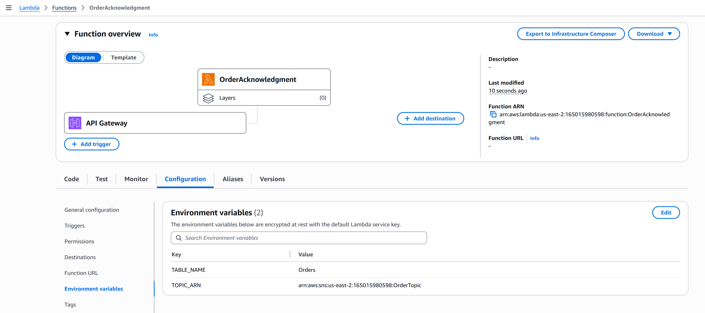
**Best Practice:** Use environment variables instead of hardcoding ARNs/Table Names

---

### Step 6: Deploy Lambda Function

**Create Deployment Package ( Method-1 ) : In Windows**
1. In VS Code, right-click `order-acknowledgment` folder
2. Select **Reveal in File Explorer**
3. Select all files: `index.js`, `package.json`, `sns-client.js`, `ddb-client.js`, `node_modules/`
4. Right-click → **Send to** → **Compressed (zipped) folder**
5. Name: `order-acknowledgement.zip`

**Create Deployment Package ( Method-2) : In WSL**

```
cd src/order-acknowledgement

zip -r /mnt/c/Users/<user>/Downloads/order-acknowledgement.zip .
```

**Upload to Lambda:**
1. Go to **Lambda Console**
2. Open **OrderAcknowledgment** function
3. Click **Upload from** → **.zip file**
4. Click **Upload**
5. Select `order-acknowledgment.zip`
6. Click **Save**

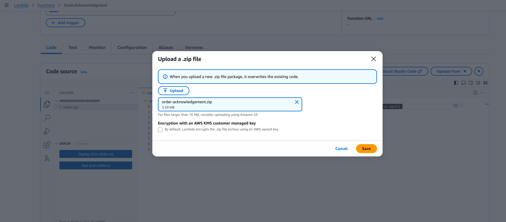

**Wait:** Upload completes and Lambda shows "Changes deployed"

---

### Step 7: Review the Deployed Code

1. Go to **Code** tab
2. Verify file structure:
   - index.js
   - package.json
   - sns-client.js
   - ddb-client.js
   - node_modules/ (hidden)
3. Open index.js and review code
4. Check for syntax errors (should be none)

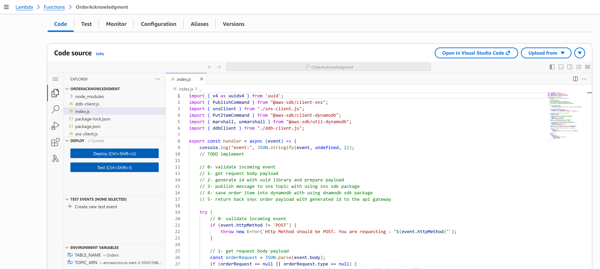

---

### Step 8: Test Order Acknowledgment Lambda

**Prepare Test Payload:**
```json
{
  "customerId": "CUST-001",
  "customerName": "John Doe",
  "customerEmail": "john@example.com",
  "item": "iPhone 15",
  "totalAmount": 999.99,
  "type": "shipment required",
  "status": "placed"
}
```

**Send Request via Postman:**
1. Open **Postman**
2. POST request to API Gateway URL
3. Headers: `Content-Type: application/json`
4. Body: Paste test payload
5. Click **Send**

**Check Response: Success Indicators**
- Status 200
- Message includes generated order ID
- No errors in response

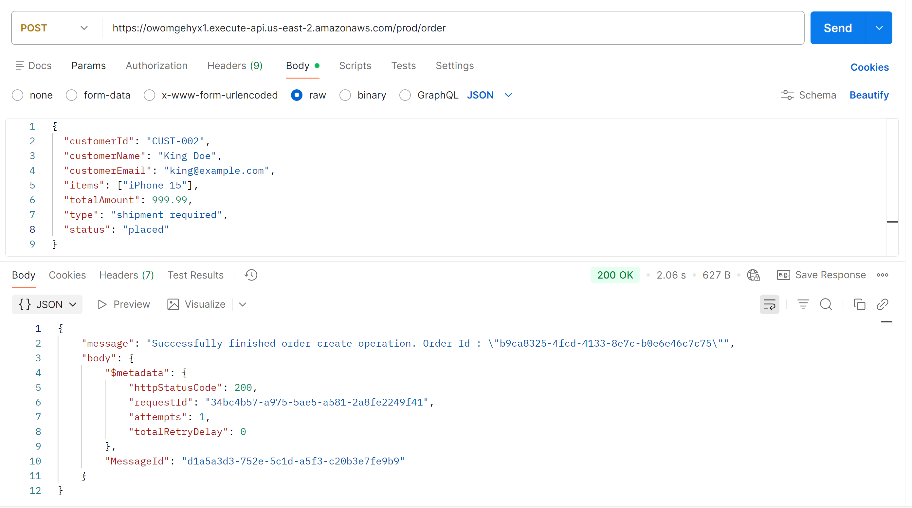

---

### Step 9: Verify DynamoDB Entry

1. Go to **DynamoDB Console**
2. Open **Orders** table
3. Click **Explore table items**
4. Verify new order with generated ID exists
5. Check all attributes match payload

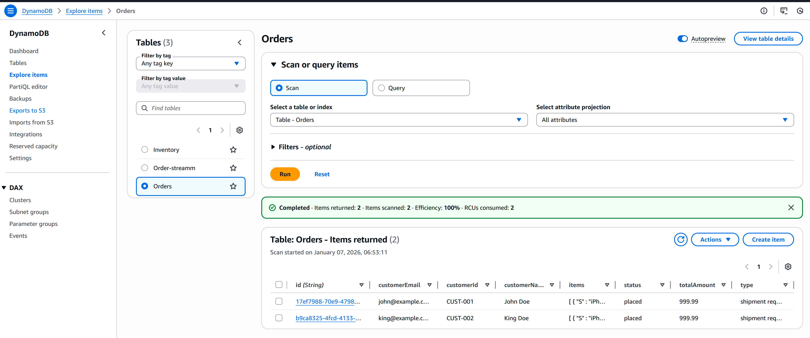

---

### Step 10: Check CloudWatch Logs : To Verify Lambda Invocations

**Check Downstream Lambda functions**
1. Go to **Lambda Console**
2. Open **NotificationMicroservice**
3. Go to **Monitor** tab
4. Click **View CloudWatch logs**
5. In the opened **CloudWatch console** window , select and open the latest **log stream**
6. Verify that lambda function has received and recorded the event
8. Repeat the steps 1-6 for **InventoryMicroservice** **ShipmentMicroservice**

**Expected Log Structure:**
```json
{
  "Records": [
    {
      "messageId": "...",
      "body": "{\"Type\":\"Notification\",\"Message\":\"{...}\"}"
    }
  ]
}
```

**Key Observation:** Message is nested:
- SQS Record → body (string)
- SNS Wrapper → Message (string)
- Actual Order Data (JSON object)

**This nested structure requires double parsing in downstream functions.**

---

## Part 3: Develop Inventory Microservice

### Understanding Inventory Microservice Business Logic

**Inventory Responsibilities:**
1. Poll messages from InventoryQueue (Event Source Mapping)
2. Parse nested JSON (SQS → SNS → Order Data)
3. Validate order type (initially code-level, later filter-level)
4. Save inventory record to DynamoDB
5. Return success (message auto-deleted from queue)

**Required Packages:**
- `@aws-sdk/client-dynamodb`
- `@aws-sdk/util-dynamodb`

---

### Step 1: Create and Initialize Porject

#### 1.1 Create folder structure:
```
src/inventory-ms/
├── index.js
├── package.json
└── ddb-client.js
```

---

#### 1.2 Initialize Node.js Project

```bash
cd inventory-ms
npm init -y
```

Edit `package.json`:
```json
{
  "name": "inventory-microservice",
  "version": "1.0.0",
  "type": "module"
}
```

---

#### 1.3 Install Required Packages

```bash
npm install @aws-sdk/client-dynamodb
```

```bash
npm install @aws-sdk/util-dynamodb
```

---

### Step 2: Create DynamoDB Client

Create `src/inventory-ms/ddb-client.js`:

```javascript
import { DynamoDBClient } from "@aws-sdk/client-dynamodb";
const REGION = "us-east-2";
const ddbClient = new DynamoDBClient({ region: REGION });
export { ddbClient };
```
---

### Step 3: Understand Nested JSON Structure

**Sample Event from SQS to inventory-microservice**
```json
{
  "Records": [
    {
      "messageId": "abc123",
      "receiptHandle": "...",
      "body": "{\"Type\":\"Notification\",\"MessageId\":\"...\",\"Message\":\"{\\\"customerId\\\":\\\"CUST-001\\\",\\\"type\\\":\\\"shipment requirement\\\"}\"}"
    }
  ]
}
```

**Parsing Levels:**
1. **Level 1:** `event.Records` → Array of SQS records
2. **Level 2:** `record.body` → String (SNS wrapper)
3. **Level 3:** `snsMessage.Message` → String (actual order)
4. **Level 4:** Parse to get order object

---

### Step 4: Implement Inventory Microservice Lambda

Create `src/inventory-ms/index.js`:

```javascript
import { PutItemCommand } from "@aws-sdk/client-dynamodb";
import { marshall, unmarshall } from "@aws-sdk/util-dynamodb";
import { ddbClient } from "./ddb-client.js";

export const handler = async function (event) {
    console.log("request:", JSON.stringify(event, undefined, 2));

    // 1- iterate sqs records
    // 2- get request body payload of sns
    // 3- get request body payload of order data
    // 4- save order item into inventory dynamodb table with using dnamodb sdk package

    try {
        // 1- iterate sqs records
        for (const record of event.Records) {
            console.log('SQS Record: %j', record);

            // 2- get request body payload of sns
            const snsPublishedMessage = JSON.parse(record.body);
            console.log('SNS Message: %j', snsPublishedMessage);

            // 3- get request body payload of order data
            const orderRequest = JSON.parse(snsPublishedMessage.Message);
            console.log('Order Request Payload: %j', orderRequest);

            // business logic and prepared inventoryItem
            if (orderRequest == null || orderRequest.type == null || orderRequest.type != 'SHIP_REQUIRED') {
                throw new Error(`order type should exist and should be SHIP_REQUIRED in orderRequest: "${orderRequest}"`);
            }

            // set PK of invetory table
            orderRequest.code = orderRequest.item;
            console.log("DynamoDB orderRequest:", JSON.stringify(orderRequest, null, 2));

            // 4- save order item into inventory dynamodb table with using dnamodb sdk package
            // Using environment variable TABLE_NAME instead of hardcoding table name
            const dynamodbParams = {
                TableName: process.env.TABLE_NAME,
                Item: marshall(orderRequest || {}, {
                    removeUndefinedValues: true  // Remove an item ,if its "undefined"
                })
            };

            const createResult = await ddbClient.send(new PutItemCommand(dynamodbParams));
            console.log("Successfully create item into inventory table.", createResult);
        }

    } catch (e) {
        console.error(e);
    }
};
```

**Implementation Steps:**
1. Iterate through `event.Records`
2. Parse `record.body` to get SNS wrapper
3. Parse `snsWrapper.Message` to get order data
4. Validate order type = "shipment requirement"
5. Set partition key: `code = orderRequest.items`
6. Save to DynamoDB Inventory table

**Business Rule (Code-Level):**
- Only process orders with `type === "SHIP_REQUIRED"`
- Throw error for other types
- (This will be replaced by SNS filters later)

---

### Step 5: Create & Set Lambda Environment Variables

1. Go to **Lambda Console**
2. Open **InventoryMicroservice**
3. **Configuration** → **Environment variables**
4. Add:
   - Key: `TABLE_NAME`
   - Value: `Inventory`
5. Click **Save**

---

### Step 6: Deploy Lambda

**Create Deployment Package ( Method-2) : In Windows**
1. Select all files in `inventory-ms` folder
2. Create zip: `inventory-ms.zip`

**Create Deployment Package ( Method-2) : In WSL**
```
cd src/inventory-ms
zip -r /mnt/c/Users/<user>/Downloads/inventory-ms.zip .
```

**Upload to Lambda**
1. Go to Lambda Console → **InventoryMicroservice**
2. **Upload from** → **.zip file**
3. Upload `inventory-ms.zip`
4. Click **Save**

---

### Step 7: Add IAM Permissions

1. Go to **Configuration** → **Permissions**
2. Click **Role name** link displayed ( This will open the role in IAM)
1. Click **Add permissions** → **Attach policies**
2. Search: `AmazonDynamoDBFullAccess` (This is required to make DynamoDB `PutItem` action)
3. Click **Add permissions**

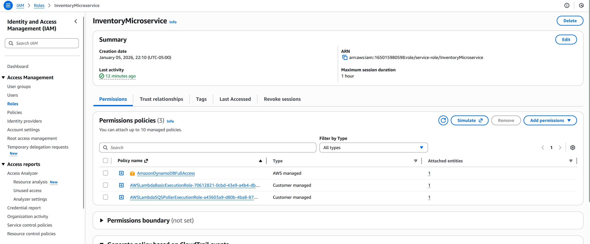

---

### Step 8: Test End-to-End Flow

**Prepare Test Payload:**
```json
{
  "customerId": "CUST-003",
  "customerName": "Charles Doe",
  "customerEmail": "carles@example.com",
  "item": "iPhone 16",
  "totalAmount": 1299.99,
  "type": "SHIP_REQUIRED",
  "status": "placed"
}
```
**Note:** As per updated inventory microservice code, if **type** is not equal to **SHIP_REQUIRED** , it will thorw error
```
            // business logic and prepared inventoryItem
            if (orderRequest == null || orderRequest.type == null || orderRequest.type != 'SHIP_REQUIRED') {
                throw new Error(`order type should exist and should be SHIP_REQUIRED in orderRequest: "${orderRequest}"`);
            }
```

**Send Request via Postman:**
1. Open **Postman**
2. POST request to API Gateway URL
3. Headers: `Content-Type: application/json`
4. Body: Paste test payload
5. Click **Send**

**Check Response: Success Indicators**
- Status 200
- Message includes generated order ID
- No errors in response

---

### Step 9: Verify DynamoDB Entry

**Verify Order Table:**
1. Go to **DynamoDB Console**
2. Open **Orders** table
3. Click **Explore table items**
4. Verify new order with generated ID exists
5. Check all attributes match payload

**Verify Inventory Table:**
1. Open **Inventory** table
2. **Explore table items**
3. Verify record exists with `code = "iPhone 16"`

---

### Step 10: Check CloudWatch Logs

**Check Log for Inventory Microservice**
1. Go to Lambda **InventoryMicroservice**
2. **Monitor** → **View CloudWatch logs**
3. Open latest log stream

**Expected Logs:**
```
INFO SQS Record: {...}
INFO SNS Message: {...}
INFO Postman Order Request Payload: {"customerId":"CUST-003",...}
INFO DynamoDB orderRequest: { "customerId": "CUST-010",...}
INFO Successfully create item into inventory table.
```

**Check Log for Notification & Shipment Microservice**
1. Go to Lambda **NotificationMicroservice**
2. **Monitor** → **View CloudWatch logs**
3. Open latest log stream
4. Verify that lambda function has received and recorded the event
5. Repeat the steps 1-4 for **ShipmentMicroservice**

---

### Step 12: Test with Different Order Type

**Send Notification-Only Order:**
```json
{
  "customerId": "CUST-011",
  "customerName": "JJJJ Pearl",
  "customerEmail": "jjjj@example.com",
  "item": "iPhone 16",
  "totalAmount": 1299.99,
  "type": "ORDER_CREATED",
  "status": "created"
}
```

**Expected Behavior:**
- OrderAcknowledgement: ✅ Order ID Created successfully and Order entry added in Orders table
- NotificationMicroservice: ✅ Processes successfully
- InventoryMicroservice: ❌ Throws error (type !== "shipment requirement")
- ShipmentMicroservice: ✅ Processes successfully
- DynamoDB Table updates : Only Orders Table updated.No Update in Inventory table

**Check Inventory Lambda Logs:**
- Should show error: "ERROR Error: order type should exist and should be SHIP_REQUIRED in orderRequest"
- Lambda invoked but threw error


**Problem:** Lambda still invokes even though message not relevant. This wastes compute and increases costs.

**Solution:** Implement SNS subscription filter policies (Part 4)

---

## Part 4: Implement SNS Message Filtering

### Understanding SNS Filter Policies

**Problem Without Filters:**
- All subscribed queues receive every message
- Lambda functions invoked even for irrelevant messages
- Unnecessary compute costs
- Need code-level validation to discard messages

**Solution: SNS Subscription Filter Policies**
- Filter at SNS level before delivery to SQS
- Only relevant messages delivered to queues
- Reduces Lambda invocations
- Removes need for code-level type checking
- Saves costs and simplifies code

**How It Works:**
1. Define filter policy JSON on SNS subscription
2. SNS evaluates message attributes against policy
3. If match → delivers to queue
4. If no match → discards (no delivery, no cost)

---

### Step 1: Understand Filter Policy Syntax

**Basic Filter Policy:**
```json
{
  "type": ["SHIP_REQUIRED"]
}
```

**Explanation:**
- Top-level key: `type` (message attribute to filter on)
- Value: Array of acceptable values
- Can include multiple values: `["value1", "value2"]`
- Can filter on multiple attributes

**Advanced Examples:**
```json
{
  "type": ["SHIP_REQUIRED", "PRIORITY_SHIPMENT"],
  "totalAmount": [{"numeric": [">", 100]}]
}
```

---

### Step 2: Apply Filter to Inventory Queue Subscription

1. Go to **SNS Console**
2. Open **OrderTopic**
3. Go to **Subscriptions** tab
4. Click on **InventoryQueue** subscription ID

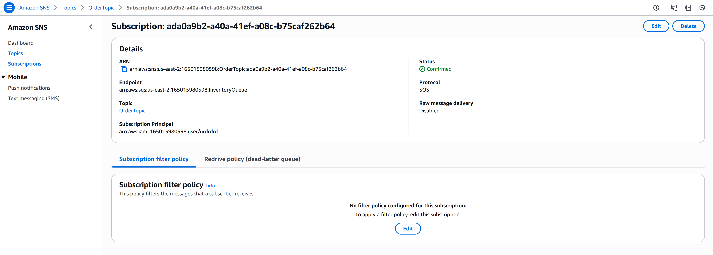

---

### Step 3: Configure Subscription Filter Policy

1. Click **Edit** in **Subscription filter policy**  tab
2. Expand **Subscription filter policy** and enable **Subscription filter policy**
3. select **Message body**
4. paste below code in **JSON Editor**
```json
{
  "type": ["SHIP_REQUIRED"]
}
```
5. Click **Save changes**

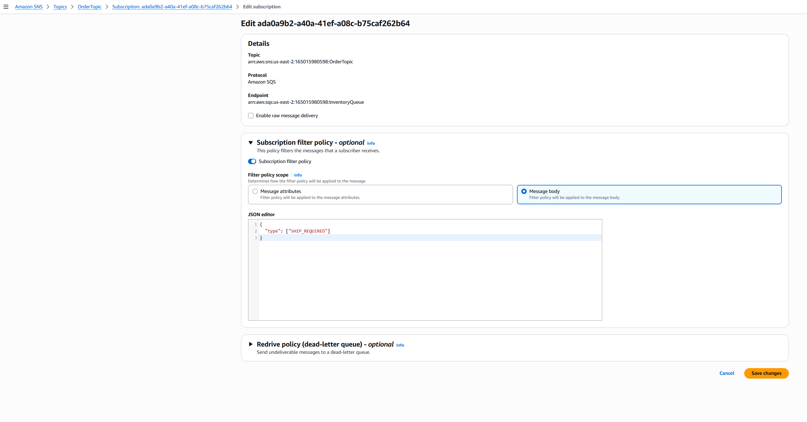

**Result:** Only messages with `type = SHIP_REQUIRED` delivered to InventoryQueue

---

### Step 4: Test End-to-End Flow : Verify Filter Policy

**Prepare Test Payload & Send Request via Postman:**
```json
{
  "customerId": "CUST-003",
  "customerName": "Charles Doe",
  "customerEmail": "carles@example.com",
  "item": "iPhone 16",
  "totalAmount": 1299.99,
  "type": "SHIP_REQUIRED",
  "status": "placed"
}
```

**Check Response: Success Indicators**
- Status 200
- Message includes generated order ID
- No errors in response

**Expected Behavior:**
- OrderAcknowledgement: ✅ Order ID Created successfully and Order entry added in Orders table
- NotificationMicroservice: ✅ Processes successfully
- InventoryMicroservice: ✅ No Logs
- ShipmentMicroservice: ✅ Processes successfully
- DynamoDB Table updates : Only Orders Table updated.No Update in Inventory table

**Check Inventory Lambda Logs:**
- Lambda not invoked as message to its corresponding SQS queue is filterred

**SNS Message Filtering behavior**
- OrderAcknowledgement sends the Order message to SNS "OrderTopic"
- SNS sends(fans-out) the message  to ShipmentQueue and NotificationQueue
- But SNS filters the message, since its `type = SHIP_REQUIRED` and not sending it to InventoryQueue
